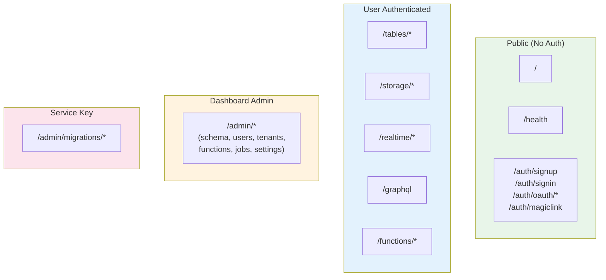

We believe in being transparent about how Fluxbase is built. This page explains our development philosophy, the role AI plays, and why this approach produces a better product.

## The Origin Story

Fluxbase was born from a real problem: building [Wayli](https://wayli.io), a self-hosted location tracking platform, I realized no one would use a product whose backend required Supabase-level infrastructure complexity. So I built what I actually needed—a Backend-as-a-Service that runs as a **single binary** with PostgreSQL as the only dependency.

Solo developer, ambitious scope, so I embraced AI assistance for velocity. The core principle: **AI writes code, humans own security.**

## How We Use AI

- **Human-led architecture** — System design, security patterns, and data models are human-designed
- **AI-assisted implementation** — AI writes boilerplate, handlers, tests, and documentation
- **Iterative refinement** — Multiple review cycles refine and validate all code
- **Security-first constraints** — Security patterns are non-negotiable requirements

## Security Through Simplicity

Fluxbase's architecture eliminates entire classes of vulnerabilities by making security explicit.

### API Registry

Every route is registered with explicit auth requirements:

```go
type Route struct {
    Auth         AuthRequirement  // none, optional, required, dashboard, service_key
    Scopes       []string
    TenantScoped bool
}
```

Routes cannot exist without being in the registry. Auth is declared, not bolted on—middleware is auto-injected. Gap audits are trivial: `grep "Auth: AuthNone"` shows all public endpoints.

### Declarative Schema

Schema files show current state, not migration history. Security reviews don't require git archaeology—RLS policies, GRANTs, and constraints are visible in one place.

### Row-Level Security

RLS enforces data access at the database level. Application bugs cannot bypass it.

### Additional Protections

AES-256-GCM encryption for secrets, rate limiting per endpoint, tenant-scoped connection pools, audit logging, and enforced parameterized queries.

## API Surface



All routes without explicit `Auth: AuthNone` require authentication. Public routes are the exception, not the rule.

## What You're Getting

**What you can expect:** A functional, secure backend with security patterns enforced at the architecture level.

**What might happen:** Occasional edge cases or bugs, some features that need refinement on first release.

**How we handle it:** Transparent issue tracking on GitHub, rapid response to security vulnerabilities, active acceptance of community fixes.

**Why it's still safe:** Security isn't implemented feature-by-feature—it's baked in. RLS, parameterized queries, and scope validation are default patterns.

## Quality Gates

Every change passes `go fmt`, `golangci-lint`, TypeScript type-checking, and tests (25%+ coverage). Security patterns—parameterized queries, RLS on all user data, scope validation, no secrets in code—are enforced by pre-commit hooks and CI.

## Our Commitment

1. **Transparency** — We'll always be upfront about how Fluxbase is built
2. **Security-first** — Security decisions are made by humans, not delegated to AI
3. **Simplicity** — We'll keep the codebase understandable and auditable
4. **Responsiveness** — Security issues get immediate attention
5. **Community** — We welcome contributions, security audits, and scrutiny

Released under AGPLv3. If you're evaluating Fluxbase, [read the code](https://github.com/nimbleflux/fluxbase)—the best verification is seeing for yourself.

---

## Learn More

- [Security Overview](/security/overview/) — Our security architecture in detail
- [Row-Level Security Guide](/guides/row-level-security/) — How RLS protects your data
- [API Reference](/api/) — HTTP API documentation
- [GitHub Repository](https://github.com/nimbleflux/fluxbase) — Source code
- [Discord Community](https://discord.gg/BXPRHkQzkA) — Join the conversation
