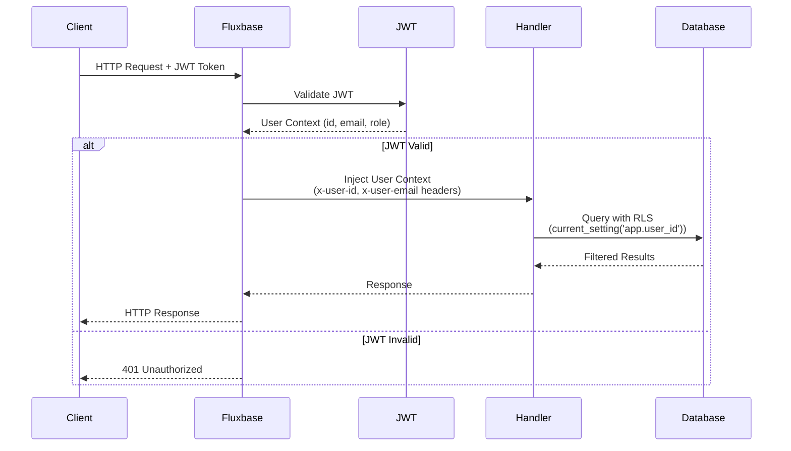

Fluxbase provides JWT-based authentication with support for email/password, magic links, OAuth, anonymous auth, and two-factor authentication.

## Features

- Email/password authentication
- Magic links (passwordless)
- OAuth providers (Google, GitHub, Microsoft, etc.)
- Anonymous authentication
- Two-factor authentication (TOTP)
- Password reset flows

## Configuration

Configure authentication in your config file or via environment variables:

```yaml
auth:
  jwt_secret: "your-secret-key"
  jwt_expiry: 15m
  refresh_expiry: 168h # 7 days
  password_min_length: 8
  bcrypt_cost: 12
  signup_enabled: true
  magic_link_enabled: false
```

### Password Requirements

Default requirements:

- Minimum 8 characters
- Maximum 72 characters (bcrypt limit)

Optional requirements (configurable):

- Uppercase letters
- Lowercase letters
- Digits
- Special characters

## Installation

```bash
npm install @nimbleflux/fluxbase-sdk
```

## Quick Start

```typescript
import { createClient } from "@nimbleflux/fluxbase-sdk";

const client = createClient("http://localhost:8080", "your-anon-key");

// Sign up with user metadata
const { user, session } = await client.auth.signUp({
  email: "user@example.com",
  password: "SecurePassword123",
  options: {
    data: {
      name: "John Doe",
      avatar_url: "https://...",
    },
  },
});

// Sign in
const { user, session } = await client.auth.signIn({
  email: "user@example.com",
  password: "SecurePassword123",
});

// Get current user
const user = await client.auth.getCurrentUser();

// Sign out
await client.auth.signOut();
```

## Core Authentication Methods

| Method                   | Purpose                  | Parameters                           |
| ------------------------ | ------------------------ | ------------------------------------ |
| `signUp()`               | Create new account       | `email`, `password`, `options.data?` |
| `signIn()`               | Sign in with credentials | `email`, `password`                  |
| `signOut()`              | End current session      | None                                 |
| `getCurrentUser()`       | Get authenticated user   | None                                 |
| `getSession()`           | Get session details      | None                                 |
| `sendPasswordReset()`    | Request password reset   | `email`                              |
| `resetPassword()`        | Confirm password reset   | `token`, `newPassword`               |

**Example:**

```typescript
// Sign up with metadata (Supabase-compatible)
const { user, session } = await client.auth.signUp({
  email: "user@example.com",
  password: "SecurePassword123",
  options: {
    data: {
      name: "John Doe",
      role: "developer",
    },
  },
});

// Sign in
const { user, session } = await client.auth.signIn({
  email: "user@example.com",
  password: "SecurePassword123",
});

// Get current user
const user = await client.auth.getCurrentUser();

// Sign out
await client.auth.signOut();
```

## Password Reset

```typescript
await client.auth.sendPasswordReset("user@example.com");

await client.auth.resetPassword("reset-token-from-email", "NewSecurePassword123");
```

## Magic Links

```typescript
await client.auth.sendMagicLink({ email: "user@example.com" });
// User clicks link in email, automatically signed in
```

## OAuth / Social Login

**Supported providers:** Google, GitHub, Microsoft, GitLab, Bitbucket, Facebook, Twitter/X, Discord, Slack

**Configuration:**

```yaml
oauth:
  google:
    client_id: "your-client-id"
    client_secret: "your-client-secret"
    redirect_url: "http://localhost:8080/api/v1/auth/callback/google"
```

**Usage:**

```typescript
const { url } = await client.auth.getOAuthUrl("google", {
  redirectTo: "http://localhost:3000/dashboard",
});
window.location.href = url;
// User redirected back with session after authorization
```

## Anonymous Authentication

```typescript
const { user, session } = await client.auth.signInAnonymously();
```

> **Note:** Anonymous sessions cannot be converted to permanent accounts. Users must sign up separately and link manually.

## Two-Factor Authentication

```typescript
const { id, type, totp } = await client.auth.setup2FA();
// totp.qr_code, totp.secret, totp.uri

await client.auth.verify2FA({ user_id: "user-id", code: "123456" });

const { requires_2fa } = await client.auth.signIn({ email, password });
if (requires_2fa) {
  await client.auth.verify2FA({ user_id: user.id, code: "123456" });
}

await client.auth.disable2FA("current-password");
```

## Session Management

Session management (listing, revoking sessions) is available through the Admin API, not the client SDK.

## Token Refresh

Tokens are automatically refreshed by the SDK. Manual refresh:

```typescript
const { session } = await client.auth.refreshSession();
```

## Auth State Changes

```typescript
const subscription = client.auth.onAuthStateChange((event, session) => {
  // Events: SIGNED_IN, SIGNED_OUT, TOKEN_REFRESHED, USER_UPDATED
  if (event === "SIGNED_IN") {
    console.log("User signed in:", session.user);
  }
});

subscription.unsubscribe();
```

## User Metadata

User metadata is stored during signup and can be updated at any time. Fluxbase uses a Supabase-compatible structure where metadata is passed via `options.data`.

```typescript
// Sign up with metadata (stored in user_metadata column)
const { user, session } = await client.auth.signUp({
  email: "user@example.com",
  password: "SecurePassword123",
  options: {
    data: {
      name: "John Doe",
      avatar_url: "https://...",
      preferences: { theme: "dark" },
    },
  },
});

// Update metadata (Supabase-compatible)
await client.auth.updateUser({
  data: { name: "John Doe", avatar_url: "https://..." },
});

// Update email
await client.auth.updateUser({
  email: "newemail@example.com",
});

// Update password
await client.auth.updateUser({
  password: "NewPassword123",
});
```

## client keys

```typescript
const { key, id } = await client.management.clientKeys.create({
  name: "Production API",
  expires_in: 86400 * 365,
});

const adminClient = createClient("http://localhost:8080", "your-api-key");

const keys = await client.management.clientKeys.list();
await client.management.clientKeys.revoke(key_id);
```

## Service Keys (Admin)

Service keys bypass Row-Level Security. Use only in backend services.

```typescript
const adminClient = createClient("http://localhost:8080", process.env.FLUXBASE_SERVICE_ROLE_KEY);

// Bypasses RLS
const allUsers = await adminClient.from("users").select("*");
```

**Security:** Store in secrets management, use environment variables, never expose in client code.

## REST API

For direct HTTP access without the SDK, see the [API Reference](/api/sdk/classes/fluxbaseauth/).

## Reference

### JWT Token Structure

Access tokens contain:

```json
{
  "user_id": "uuid",
  "email": "user@example.com",
  "role": "authenticated",
  "session_id": "uuid",
  "token_type": "access",
  "iss": "fluxbase",
  "sub": "user-id",
  "iat": 1698307200,
  "exp": 1698308100
}
```

### User Roles

- `anonymous` - Guest users (limited access)
- `authenticated` - Logged-in users
- `service_role` - Admin/backend services (bypass RLS)

Configure role-based access with Row-Level Security policies.

### Authentication Flow

When a request includes a JWT token, Fluxbase validates it and injects user context for use by edge functions, RLS policies, and other services:



**Flow explanation:**

1. **Client sends request** with JWT token in `Authorization: Bearer <token>` header
2. **Fluxbase validates JWT** using the configured secret key
3. **User context extracted** from token payload (user_id, email, role)
4. **Context injected** into request:
   - Headers: `x-user-id`, `x-user-email` (available to edge functions)
   - PostgreSQL settings: `app.user_id`, `app.user_email` (available to RLS policies)
5. **Handler processes request** with user context available
6. **Database queries respect RLS** policies using `current_setting('app.user_id')`
7. **Response returned** to client

This flow ensures that user identity is consistently available throughout the request lifecycle, enabling secure data access control via Row-Level Security policies.

## Enterprise Authentication

Fluxbase supports enterprise-grade authentication methods:

### SAML SSO

Configure SAML 2.0 Single Sign-On for enterprise authentication with providers like Okta, Azure AD, OneLogin, and more.

**See:** [SAML SSO Guide](/guides/saml-sso/) for complete setup instructions.

### OAuth Providers & OIDC

Configure OAuth 2.0 and OpenID Connect authentication with social providers and enterprise IdPs.

**See:** [OAuth Providers Guide](/guides/oauth-providers/) for provider-specific setup instructions.

## CAPTCHA Integration

Protect your authentication flows from automated attacks with CAPTCHA verification.

Fluxbase supports multiple CAPTCHA providers:

| Provider                 | Description                        |
| ------------------------ | ---------------------------------- |
| **Cloudflare Turnstile** | Invisible CAPTCHA, user-friendly   |
| **Google reCAPTCHA v2**  | Classic "I'm not a robot" checkbox |
| **Google reCAPTCHA v3**  | Invisible CAPTCHA, score-based     |
| **hCaptcha**             | Privacy-focused CAPTCHA            |
| **Cap (self-hosted)**    | Self-hosted CAPTCHA solution       |

### Configuration

```yaml
security:
  captcha:
    enabled: true
    provider: turnstile # recaptcha, hcaptcha, turnstile, captcha-v2, cap
    site_key: your-site-key
    secret_key: your-secret-key
```

### Usage

CAPTCHA is automatically verified during:

- User signup
- User login (when adaptive trust determines it's needed)
- Password reset requests
- Magic link requests

For more details, see [Security Best Practices](/security/best-practices/).

## User Impersonation

Administrators can impersonate other users for debugging and support purposes.

### Enable Impersonation

```yaml
auth:
  impersonation_enabled: true
```

### Usage (Admin Dashboard)

```typescript
const { impersonation } = await client.admin.impersonation.impersonateUser({
  userId: "target-user-id",
});

await client.admin.impersonation.stopImpersonation();
```

### Security Notes

⚠️ **Impersonation is a powerful feature - use with caution:**

- Only enable `impersonation_enabled` for admin users
- All impersonation actions are logged
- Requires dashboard admin role
- Cannot impersonate other admins (prevents privilege escalation)

## Next Steps

- [Row-Level Security](/guides/row-level-security) - Secure data with RLS policies
- [OAuth Providers](/guides/oauth-providers) - Configure social login
- [SAML SSO](/guides/saml-sso/) - Configure enterprise SSO
- [Security Best Practices](/security/best-practices/) - Security hardening guide
