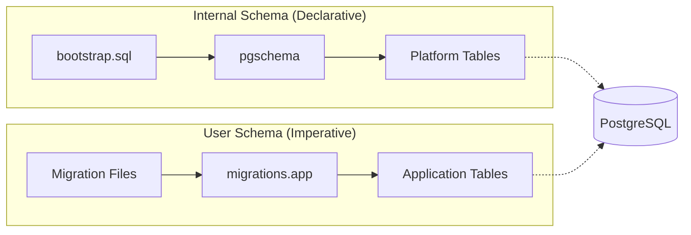

Fluxbase uses a **declarative schema management** approach for internal platform tables, combined with optional **imperative migrations** for your application schema.

## Overview

Fluxbase provides two ways to manage database schema:

1. **Declarative Schema (Internal)** - Fluxbase platform tables managed automatically via bootstrap + pgschema
2. **User Migrations (Optional)** - Your custom application tables via imperative SQL migration files



## Declarative Schema (Internal)

**Purpose:** Platform infrastructure managed automatically by Fluxbase

The internal Fluxbase schema (auth, storage, functions, jobs, etc.) is managed declaratively:

- **bootstrap.sql** - Creates schemas, extensions, roles, and default privileges (idempotent)
- **pgschema** - Compares desired schema files to actual database state and applies diffs

**Tracking:** `migrations.declarative_state` table stores schema fingerprint

**Execution:** Automatically applied on server startup

**Schema files location:** `internal/database/schema/schemas/`

### How It Works

1. On startup, Fluxbase runs `bootstrap.sql` to ensure schemas and roles exist
2. The pgschema tool compares schema files to the actual database
3. Any differences are applied automatically
4. The schema fingerprint is stored for drift detection

### Benefits

- **No version numbers** - Schema is the source of truth
- **Automatic drift detection** - Can detect if database was modified outside Fluxbase
- **Safe by default** - Destructive changes require explicit approval
- **Works with CI/CD** - Schema is applied automatically, no migration commands needed

## User Migrations (Optional)

**Purpose:** Application-specific schema managed by you

User migrations allow you to add your own custom database schema using traditional imperative migration files.

**Tracking:** `migrations.app` table

**Execution:** Run on startup if `DB_USER_MIGRATIONS_PATH` is configured

**File format:** Standard golang-migrate format with `.up.sql` and `.down.sql` files

### When to Use User Migrations

| Use Declarative (Internal)  | Use User Migrations               |
| --------------------------- | --------------------------------- |
| Never (managed by Fluxbase) | Application tables                |
|                             | Custom indexes                    |
|                             | Data transformations              |
|                             | Business logic triggers           |
|                             | Application-specific RLS policies |

### Migration File Format

User migrations follow the standard golang-migrate format:

```text
001_create_users_table.up.sql
001_create_users_table.down.sql
002_add_timestamps.up.sql
002_add_timestamps.down.sql
```

Each migration has two files:

- **`.up.sql`** - Applied when migrating forward
- **`.down.sql`** - Applied when rolling back (optional but recommended)

### Migration Numbering

Migrations are executed in numerical order based on the prefix. Best practices:

- Use sequential numbering: `001`, `002`, `003`, etc.
- Zero-pad numbers for proper sorting
- Never reuse or skip numbers
- Never modify a migration that has already been applied

### Example Migration

**001_create_products_table.up.sql:**

```sql
-- Create products table in public schema
CREATE TABLE IF NOT EXISTS public.products (
    id UUID PRIMARY KEY DEFAULT gen_random_uuid(),
    name TEXT NOT NULL,
    description TEXT,
    price DECIMAL(10,2) NOT NULL,
    created_at TIMESTAMPTZ NOT NULL DEFAULT NOW(),
    updated_at TIMESTAMPTZ NOT NULL DEFAULT NOW()
);

-- Add RLS policies
ALTER TABLE public.products ENABLE ROW LEVEL SECURITY;

-- Allow all authenticated users to read products
CREATE POLICY "Products are viewable by authenticated users"
    ON public.products
    FOR SELECT
    TO authenticated
    USING (true);

-- Allow only admins to insert/update/delete products
CREATE POLICY "Products are manageable by admins"
    ON public.products
    FOR ALL
    TO authenticated
    USING (auth.role() = 'admin')
    WITH CHECK (auth.role() = 'admin');
```

**001_create_products_table.down.sql:**

```sql
-- Drop the table (this will also drop policies)
DROP TABLE IF EXISTS public.products CASCADE;
```

## Configuration

### Docker Compose

To enable user migrations in Docker Compose:

1. Create a directory for your migrations:

```bash
mkdir -p deploy/migrations/user
```

2. Add your migration files to this directory

3. Update `docker-compose.yml`:

```yaml
services:
  fluxbase:
    environment:
      # Enable user migrations
      DB_USER_MIGRATIONS_PATH: /migrations/user
    volumes:
      # Mount migrations directory (read-only)
      - ./migrations/user:/migrations/user:ro
```

4. Restart Fluxbase:

```bash
docker compose restart fluxbase
```

### Kubernetes (Helm)

To enable user migrations in Kubernetes:

1. Create a ConfigMap or PVC with your migration files

**Option A: Using ConfigMap (for small migrations):**

```bash
kubectl create configmap user-migrations \
  --from-file=migrations/user/ \
  -n fluxbase
```

**Option B: Using PVC (recommended for production):**

```yaml
# values.yaml
migrationsPersistence:
  enabled: true
  size: 100Mi
  storageClass: "" # Use cluster default

config:
  database:
    userMigrationsPath: /migrations/user
```

2. Install or upgrade the Helm chart:

```bash
helm upgrade --install fluxbase ./deploy/helm/fluxbase \
  --namespace fluxbase \
  --create-namespace \
  -f values.yaml
```

3. Copy your migration files to the PVC:

```bash
# Find a pod
POD_NAME=$(kubectl get pod -n fluxbase -l app.kubernetes.io/name=fluxbase -o jsonpath="{.items[0].metadata.name}")

# Copy migrations
kubectl cp migrations/user/ fluxbase/$POD_NAME:/migrations/user/
```

4. Restart the deployment:

```bash
kubectl rollout restart deployment/fluxbase -n fluxbase
```

### Environment Variables

You can configure user migrations via environment variables:

| Variable                  | Description                       | Default         |
| ------------------------- | --------------------------------- | --------------- |
| `DB_USER_MIGRATIONS_PATH` | Path to user migrations directory | `""` (disabled) |

When `DB_USER_MIGRATIONS_PATH` is empty or not set, user migrations are skipped.

## Startup Flow

When Fluxbase starts, schema is applied in this order:

1. **Bootstrap SQL** - Creates schemas, extensions, roles (idempotent)
2. **Declarative Schema** - Applies internal Fluxbase schema via pgschema
3. **User Migrations** - Applies your custom migrations (if configured)

### Logs

Migration progress is logged during startup:

```
INFO Running bootstrap SQL...
INFO Bootstrap completed successfully
INFO Applying declarative schema...
INFO Schema applied successfully
INFO Running user migrations... path=/migrations/user
INFO Migrations applied successfully source=user version=3
INFO Database schema management completed
```

## Local Development

For local development, Fluxbase provides Make commands:

### Database Reset Commands

```bash
# Partial reset - preserves user data in public schema
make db-reset

# Full reset - drops ALL schemas (WARNING: destroys all data)
make db-reset-full
```

After a reset, the bootstrap and declarative schema are applied automatically on the next server startup with `make dev`.

### User Migration Commands

If you have user migrations configured:

```bash
# Create new user migration
make migrate-create name=add_products
# Creates: migrations/XXX_add_products.up.sql and .down.sql

# Apply migrations
make migrate-up

# Rollback last migration
make migrate-down
```

**Note:** These commands are for user-provided migrations only. The internal Fluxbase schema is managed declaratively and applied automatically.

## Best Practices

### 1. Test Migrations Locally First

Always test migrations in a development environment before applying to production:

```bash
# Start local environment
docker compose up -d

# Check logs for migration success
docker compose logs fluxbase | grep -i migration
```

### 2. Use Transactions

Wrap DDL statements in transactions when possible:

```sql
BEGIN;

CREATE TABLE products (...);
CREATE INDEX IF NOT EXISTS idx_products_name ON products(name);

COMMIT;
```

### 3. Make Migrations Idempotent

Use conditional statements to make migrations safe to re-run:

```sql
-- Good: Uses IF NOT EXISTS
CREATE TABLE IF NOT EXISTS products (...);

-- Bad: Will fail if table exists
CREATE TABLE products (...);
```

### 4. Add Indexes Concurrently

For large tables, create indexes without locking:

```sql
-- Add indexes concurrently (won't block reads/writes)
CREATE INDEX CONCURRENTLY idx_products_category ON products(category);
```

### 5. Plan for Rollbacks

Always include `.down.sql` files to support rollback scenarios:

```sql
-- down.sql should reverse the up.sql changes
DROP INDEX IF EXISTS idx_products_category;
DROP TABLE IF EXISTS products;
```

### 6. Document Complex Migrations

Add comments explaining the purpose of complex migrations:

```sql
-- Migration: Add full-text search to products
-- Author: Your Name
-- Date: 2024-01-15
-- Reason: Enable product search functionality

ALTER TABLE products ADD COLUMN search_vector tsvector;

CREATE INDEX IF NOT EXISTS idx_products_search
  ON products
  USING gin(search_vector);
```

## Troubleshooting

### Migration Failed

If a migration fails partway through, check the logs and fix the issue:

```sql
-- Connect to database
psql -h localhost -U fluxbase -d fluxbase

-- Check migration state
SELECT * FROM migrations.app WHERE status = 'failed';

-- After fixing the issue, mark as pending to retry
UPDATE migrations.app SET status = 'pending', error_message = '' WHERE name = 'failed_migration';
```

### Migration Not Running

If your migration isn't being applied:

1. **Check file naming**: Ensure files follow the format `NNN_name.up.sql`
2. **Check file location**: Verify files are in the configured directory
3. **Check permissions**: Ensure Fluxbase can read the migration files
4. **Check logs**: Look for migration errors in Fluxbase logs
5. **Check configuration**: Verify `DB_USER_MIGRATIONS_PATH` is set correctly

### Checking Migration Status

To see which user migrations have been applied:

```sql
-- Check user migrations
SELECT * FROM migrations.app ORDER BY applied_at DESC;
```

### Checking Declarative Schema Status

To check the internal declarative schema status:

```sql
-- Check declarative state
SELECT * FROM migrations.declarative_state;
```

Or use the admin API:

```bash
curl http://localhost:8080/api/v1/admin/internal-schema/status
```

## Advanced Topics

### Declarative Schema Management API

Fluxbase provides internal API endpoints for schema management:

| Endpoint                                     | Description                  |
| -------------------------------------------- | ---------------------------- |
| `GET /api/v1/admin/internal-schema/status`   | Check schema status          |
| `POST /api/v1/admin/internal-schema/plan`    | Preview pending changes      |
| `POST /api/v1/admin/internal-schema/apply`   | Apply schema changes         |
| `GET /api/v1/admin/internal-schema/validate` | Validate schema for drift    |
| `POST /api/v1/admin/internal-schema/dump`    | Dump current schema to files |

These endpoints are useful for CI/CD pipelines and manual schema inspection.

### Schema Drift Detection

Fluxbase can detect if the database schema has drifted from the expected state:

```bash
# Check for drift via API
curl http://localhost:8080/api/v1/admin/internal-schema/validate
```

If drift is detected, you can either:

1. Apply the declarative schema to update the database
2. Dump the current schema to update the schema files

### Running Migrations Separately

In production, you may want to run migrations separately from application startup:

1. Use the internal schema API to apply changes before deploying
2. Or use a separate init container in Kubernetes

## Related Resources

- [Row-Level Security Guide](/guides/row-level-security/)
- [Configuration Reference](/reference/configuration/)
- [Deployment Guides](/deployment/overview/)
