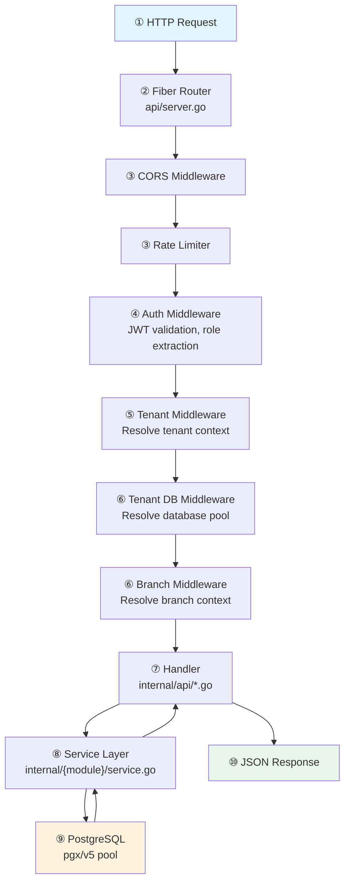

## Code Tour

The best way to understand Fluxbase is to follow a request through the system. The diagram below shows the path a typical API request takes. Below it, each numbered step lists the files you should open and read to understand what happens at that stage.



### ① Entry Point — How the server starts

Before any request arrives, the server boots up and wires everything together. Read these files to understand what happens at startup:

Open [`cmd/fluxbase/main.go`](https://github.com/nimbleflux/fluxbase/blob/main/cmd/fluxbase/main.go) and follow the `main()` function. You'll see config loading, database pool creation, service initialization, and the API server start — this is where every subsystem is wired together. Next, open [`internal/config/config.go`](https://github.com/nimbleflux/fluxbase/blob/main/internal/config/config.go) and scan the `Config` struct. The field names map directly to YAML keys and `FLUXBASE_*` env vars, so this file is a complete map of everything that's configurable. For the defaults, flip through [`internal/config/config_defaults.go`](https://github.com/nimbleflux/fluxbase/blob/main/internal/config/config_defaults.go).

### ② Routing — Where requests land

Open [`internal/api/server.go`](https://github.com/nimbleflux/fluxbase/blob/main/internal/api/server.go) and find `SetupRoutes()`. This is where all route groups are defined — admin routes, auth routes, storage routes, table CRUD routes, and which middleware each group uses. You'll see the full URL surface of Fluxbase here.

### ③ ④ Middleware — The gates every request passes through

The middleware chain runs before any handler sees the request. Open these files in order:

1. [`internal/middleware/cors.go`](https://github.com/nimbleflux/fluxbase/blob/main/internal/middleware/cors.go) — CORS header handling
2. [`internal/middleware/ratelimit.go`](https://github.com/nimbleflux/fluxbase/blob/main/internal/middleware/ratelimit.go) — Rate limiting per route
3. [`internal/middleware/auth.go`](https://github.com/nimbleflux/fluxbase/blob/main/internal/middleware/auth.go) — JWT validation, role extraction, `RequireAuth` / `RequireServiceKey`. This is where the `Authorization` header is parsed and claims land in fiber locals
4. [`internal/auth/jwt.go`](https://github.com/nimbleflux/fluxbase/blob/main/internal/auth/jwt.go) — How tokens are created, what claims they carry (`TokenClaims` struct), and how roles map to PostgreSQL roles

### ⑤ ⑥ Tenant & Branch Context — Which database to talk to

This is where multi-tenancy kicks in. Open these in order:

1. [`internal/middleware/tenant.go`](https://github.com/nimbleflux/fluxbase/blob/main/internal/middleware/tenant.go) — Tenant resolution: `X-FB-Tenant` header → JWT claims → default tenant. Sets `tenant_id`, `tenant_slug`, and the merged `tenant_config` in fiber locals
2. [`internal/middleware/tenant_db.go`](https://github.com/nimbleflux/fluxbase/blob/main/internal/middleware/tenant_db.go) — Database pool resolution. `GetPoolForSchema()` implements the branch > tenant > main priority chain
3. [`internal/middleware/branch.go`](https://github.com/nimbleflux/fluxbase/blob/main/internal/middleware/branch.go) — Branch context from `X-Fluxbase-Branch` header

### ⑦ ⑧ ⑨ Handler → Service → Database — The actual work

This is the three-layer architecture every feature follows. Trace it with the REST CRUD (the most-used feature):

1. [`internal/api/rest_crud.go`](https://github.com/nimbleflux/fluxbase/blob/main/internal/api/rest_crud.go) — The CRUD handler. See how `SELECT`, `INSERT`, `UPDATE`, `DELETE` are built from URL path and query params. Handles all `/api/v1/tables/{table}` requests
2. [`internal/api/query_parser.go`](https://github.com/nimbleflux/fluxbase/blob/main/internal/api/query_parser.go) — URL query parsing: `?select=`, `?order=`, `?col.eq=` become structured filter conditions
3. [`internal/api/query_builder.go`](https://github.com/nimbleflux/fluxbase/blob/main/internal/api/query_builder.go) — Filters → SQL `WHERE`, `ORDER BY`, `LIMIT`
4. [`internal/database/connection.go`](https://github.com/nimbleflux/fluxbase/blob/main/internal/database/connection.go) — The connection pool, transaction helpers, and the `sync.RWMutex` safety pattern
5. [`internal/database/schema.go`](https://github.com/nimbleflux/fluxbase/blob/main/internal/database/schema.go) — Schema introspection: how Fluxbase discovers tables, columns, types, and relationships to power the auto-generated API

### Digging deeper — Multi-tenancy internals

Once you've traced a request, the multi-tenancy subsystem is the most complex piece worth understanding:

1. [`internal/tenantdb/manager.go`](https://github.com/nimbleflux/fluxbase/blob/main/internal/tenantdb/manager.go) — The `Manager` struct. Read `CreateTenantDatabase()` to see the full provisioning flow: database creation → bootstrap → FDW setup → declarative schema
2. [`internal/tenantdb/fdw.go`](https://github.com/nimbleflux/fluxbase/blob/main/internal/tenantdb/fdw.go) — Foreign Data Wrapper setup: `postgres_fdw` configuration, per-tenant roles with `NOBYPASSRLS`, shared schema imports
3. [`internal/tenantdb/router.go`](https://github.com/nimbleflux/fluxbase/blob/main/internal/tenantdb/router.go) — Per-tenant connection pool cache with LRU eviction
4. [`internal/config/tenant_loader.go`](https://github.com/nimbleflux/fluxbase/blob/main/internal/config/tenant_loader.go) + [`internal/config/tenant_merge.go`](https://github.com/nimbleflux/fluxbase/blob/main/internal/config/tenant_merge.go) — Per-tenant config override loading and deep-merge logic

For the full multi-tenancy architecture (database-per-tenant, FDW, connection routing, RLS roles), see the [Multi-Tenancy Guide](/guides/multi-tenancy/).

### Database schemas — The foundation

The SQL files in [`internal/database/schema/schemas/`](https://github.com/nimbleflux/fluxbase/blob/main/internal/database/schema/schemas/) define every internal table. Start with:

- [`platform.sql`](https://github.com/nimbleflux/fluxbase/blob/main/internal/database/schema/schemas/platform.sql) — Tenants, service keys, users, memberships, settings
- [`auth.sql`](https://github.com/nimbleflux/fluxbase/blob/main/internal/database/schema/schemas/auth.sql) — Users, sessions, identities, OTP codes, client keys
- [`bootstrap.sql`](https://github.com/nimbleflux/fluxbase/blob/main/internal/database/bootstrap/bootstrap.sql) — The SQL that runs on every startup (schemas, extensions, roles, privileges)

### Tracing a complete feature — Edge Functions

To see how a full feature fits together end-to-end, trace the edge functions system:

1. [`internal/api/routes/functions.go`](https://github.com/nimbleflux/fluxbase/blob/main/internal/api/routes/functions.go) — Route definitions and middleware
2. [`internal/api/function_handler.go`](https://github.com/nimbleflux/fluxbase/blob/main/internal/api/function_handler.go) — HTTP handlers for CRUD and invocation
3. [`internal/functions/handler.go`](https://github.com/nimbleflux/fluxbase/blob/main/internal/functions/handler.go) — Proxying to the Deno runtime
4. [`internal/functions/loader.go`](https://github.com/nimbleflux/fluxbase/blob/main/internal/functions/loader.go) — Loading functions from disk at startup
5. [`internal/functions/storage.go`](https://github.com/nimbleflux/fluxbase/blob/main/internal/functions/storage.go) — Database storage for function metadata
6. [`internal/runtime/runtime.go`](https://github.com/nimbleflux/fluxbase/blob/main/internal/runtime/runtime.go) — The Deno runtime wrapper

### Tests — How to test

- [`internal/api/rest_crud_test.go`](https://github.com/nimbleflux/fluxbase/blob/main/internal/api/rest_crud_test.go) — Table-driven unit tests with mock dependencies
- [`test/e2e/`](https://github.com/nimbleflux/fluxbase/blob/main/test/e2e/) — E2E tests against a real database
- [`internal/testutil/`](https://github.com/nimbleflux/fluxbase/blob/main/internal/testutil/) — Shared helpers, mocks, and assertions

## How to Add a New Feature

### Tenant Scoping

If the feature should be tenant-scoped:
- Add `tenant_id` to the database table
- Create RLS policies for `tenant_service` role
- Ensure the middleware chain includes `TenantMiddleware` for the route group
- Use `middleware.GetTenantID(c)` in handlers to get the current tenant

### Write Tests

Add tests alongside the source file:

```go
func TestGetMyResource_Found_ReturnsResource(t *testing.T) {
    // Test implementation
}
```

### Update Documentation

- Add API endpoint to `docs/src/content/docs/api/http/index.md`
- Add guide to `docs/src/content/docs/guides/` if it's a new feature
- Update `CLAUDE.md` if it changes configuration or architecture

## Related Documentation

- [Multi-Tenancy](/guides/multi-tenancy/) - Multi-tenancy architecture and configuration
- [Row Level Security](/guides/row-level-security/) - RLS implementation details
- [Configuration](/reference/configuration/) - Complete configuration reference
- [HTTP API](/api/http/) - HTTP API endpoint reference
