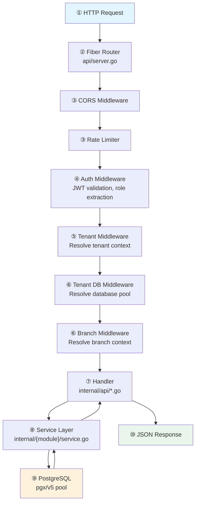
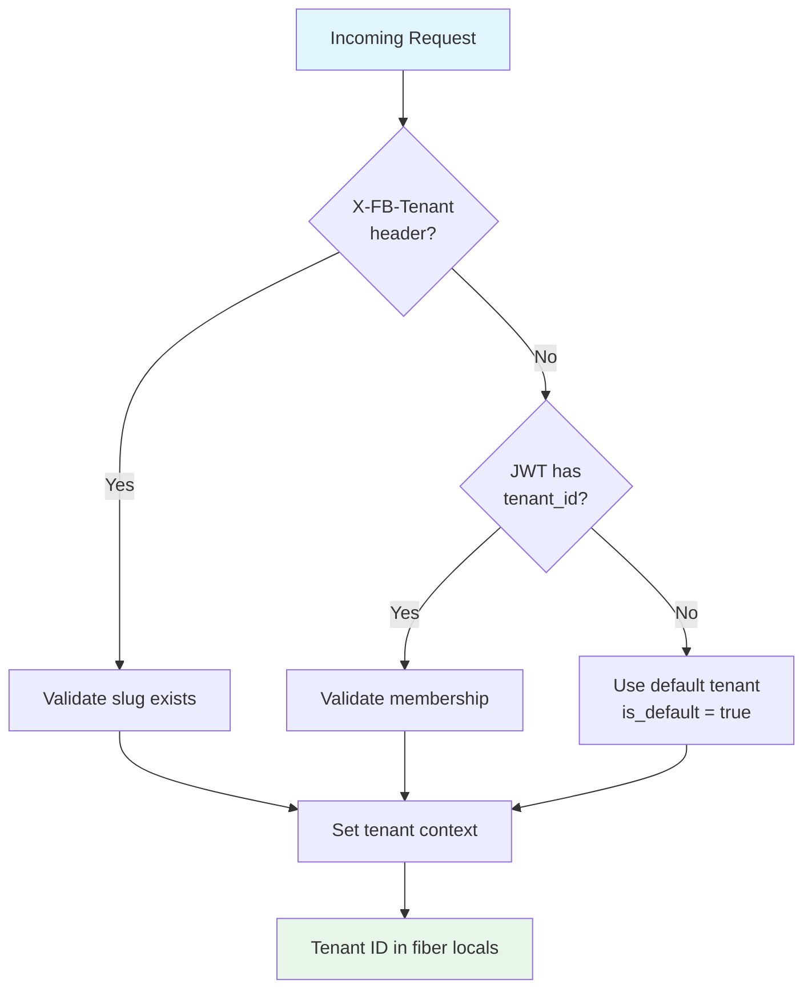
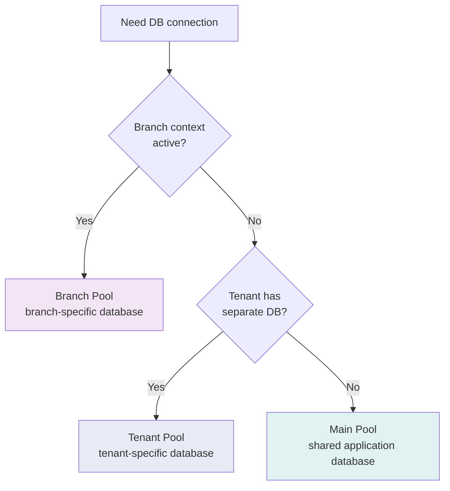
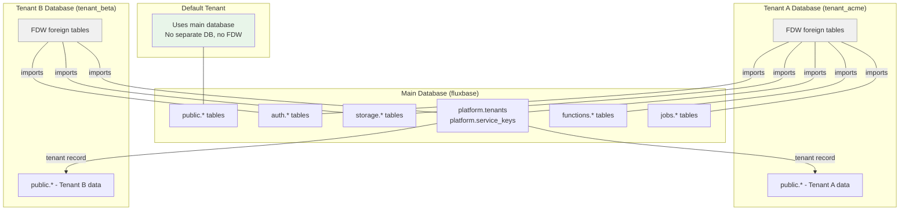
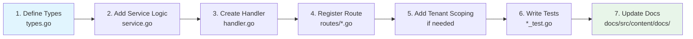

This guide helps developers understand the Fluxbase codebase, its architecture, and how to work with it effectively.

## Code Tour

The best way to understand Fluxbase is to follow a request through the system. The diagram below shows the path a typical API request takes. Below it, each numbered step lists the files you should open and read to understand what happens at that stage.



### ① Entry Point — How the server starts

Before any request arrives, the server boots up and wires everything together. Read these files to understand what happens at startup:

Open [`cmd/fluxbase/main.go`](https://github.com/nimbleflux/fluxbase/blob/main/cmd/fluxbase/main.go) and follow the `main()` function. You'll see config loading, database pool creation, service initialization, and the API server start — this is where every subsystem is wired together. Next, open [`internal/config/config.go`](https://github.com/nimbleflux/fluxbase/blob/main/internal/config/config.go) and scan the `Config` struct. The field names map directly to YAML keys and `FLUXBASE_*` env vars, so this file is a complete map of everything that's configurable. For the defaults, flip through [`internal/config/config_defaults.go`](https://github.com/nimbleflux/fluxbase/blob/main/internal/config/config_defaults.go).

### ② Routing — Where requests land

Open [`internal/api/server.go`](https://github.com/nimbleflux/fluxbase/blob/main/internal/api/server.go) and find `SetupRoutes()`. This is where all route groups are defined — admin routes, auth routes, storage routes, table CRUD routes, and which middleware each group uses. You'll see the full URL surface of Fluxbase here.

### ③ ④ Middleware — The gates every request passes through

The middleware chain runs before any handler sees the request. Open these files in order:

1. [`internal/middleware/cors.go`](https://github.com/nimbleflux/fluxbase/blob/main/internal/middleware/cors.go) — CORS header handling
2. [`internal/middleware/ratelimit.go`](https://github.com/nimbleflux/fluxbase/blob/main/internal/middleware/ratelimit.go) — Rate limiting per route
3. [`internal/middleware/auth.go`](https://github.com/nimbleflux/fluxbase/blob/main/internal/middleware/auth.go) — JWT validation, role extraction, `RequireAuth` / `RequireServiceKey`. This is where the `Authorization` header is parsed and claims land in fiber locals
4. [`internal/auth/jwt.go`](https://github.com/nimbleflux/fluxbase/blob/main/internal/auth/jwt.go) — How tokens are created, what claims they carry (`TokenClaims` struct), and how roles map to PostgreSQL roles

### ⑤ ⑥ Tenant & Branch Context — Which database to talk to

This is where multi-tenancy kicks in. Open these in order:

1. [`internal/middleware/tenant.go`](https://github.com/nimbleflux/fluxbase/blob/main/internal/middleware/tenant.go) — Tenant resolution: `X-FB-Tenant` header → JWT claims → default tenant. Sets `tenant_id`, `tenant_slug`, and the merged `tenant_config` in fiber locals
2. [`internal/middleware/tenant_db.go`](https://github.com/nimbleflux/fluxbase/blob/main/internal/middleware/tenant_db.go) — Database pool resolution. `GetPoolForSchema()` implements the branch > tenant > main priority chain
3. [`internal/middleware/branch.go`](https://github.com/nimbleflux/fluxbase/blob/main/internal/middleware/branch.go) — Branch context from `X-Fluxbase-Branch` header

### ⑦ ⑧ ⑨ Handler → Service → Database — The actual work

This is the three-layer architecture every feature follows. Trace it with the REST CRUD (the most-used feature):

1. [`internal/api/rest_crud.go`](https://github.com/nimbleflux/fluxbase/blob/main/internal/api/rest_crud.go) — The CRUD handler. See how `SELECT`, `INSERT`, `UPDATE`, `DELETE` are built from URL path and query params. Handles all `/api/v1/tables/{table}` requests
2. [`internal/api/query_parser.go`](https://github.com/nimbleflux/fluxbase/blob/main/internal/api/query_parser.go) — URL query parsing: `?select=`, `?order=`, `?col.eq=` become structured filter conditions
3. [`internal/api/query_builder.go`](https://github.com/nimbleflux/fluxbase/blob/main/internal/api/query_builder.go) — Filters → SQL `WHERE`, `ORDER BY`, `LIMIT`
4. [`internal/database/connection.go`](https://github.com/nimbleflux/fluxbase/blob/main/internal/database/connection.go) — The connection pool, transaction helpers, and the `sync.RWMutex` safety pattern
5. [`internal/database/schema.go`](https://github.com/nimbleflux/fluxbase/blob/main/internal/database/schema.go) — Schema introspection: how Fluxbase discovers tables, columns, types, and relationships to power the auto-generated API

### Digging deeper — Multi-tenancy internals

Once you've traced a request, the multi-tenancy subsystem is the most complex piece worth understanding:

1. [`internal/tenantdb/manager.go`](https://github.com/nimbleflux/fluxbase/blob/main/internal/tenantdb/manager.go) — The `Manager` struct. Read `CreateTenantDatabase()` to see the full provisioning flow: database creation → bootstrap → FDW setup → declarative schema
2. [`internal/tenantdb/fdw.go`](https://github.com/nimbleflux/fluxbase/blob/main/internal/tenantdb/fdw.go) — Foreign Data Wrapper setup: `postgres_fdw` configuration, per-tenant roles with `NOBYPASSRLS`, shared schema imports
3. [`internal/tenantdb/router.go`](https://github.com/nimbleflux/fluxbase/blob/main/internal/tenantdb/router.go) — Per-tenant connection pool cache with LRU eviction
4. [`internal/config/tenant_loader.go`](https://github.com/nimbleflux/fluxbase/blob/main/internal/config/tenant_loader.go) + [`internal/config/tenant_merge.go`](https://github.com/nimbleflux/fluxbase/blob/main/internal/config/tenant_merge.go) — Per-tenant config override loading and deep-merge logic

### Database schemas — The foundation

The SQL files in [`internal/database/schema/schemas/`](https://github.com/nimbleflux/fluxbase/blob/main/internal/database/schema/schemas/) define every internal table. Start with:

- [`platform.sql`](https://github.com/nimbleflux/fluxbase/blob/main/internal/database/schema/schemas/platform.sql) — Tenants, service keys, users, memberships, settings
- [`auth.sql`](https://github.com/nimbleflux/fluxbase/blob/main/internal/database/schema/schemas/auth.sql) — Users, sessions, identities, OTP codes, client keys
- [`bootstrap.sql`](https://github.com/nimbleflux/fluxbase/blob/main/internal/database/bootstrap/bootstrap.sql) — The SQL that runs on every startup (schemas, extensions, roles, privileges)

### Tracing a complete feature — Edge Functions

To see how a full feature fits together end-to-end, trace the edge functions system:

1. [`internal/api/routes/functions.go`](https://github.com/nimbleflux/fluxbase/blob/main/internal/api/routes/functions.go) — Route definitions and middleware
2. [`internal/api/function_handler.go`](https://github.com/nimbleflux/fluxbase/blob/main/internal/api/function_handler.go) — HTTP handlers for CRUD and invocation
3. [`internal/functions/handler.go`](https://github.com/nimbleflux/fluxbase/blob/main/internal/functions/handler.go) — Proxying to the Deno runtime
4. [`internal/functions/loader.go`](https://github.com/nimbleflux/fluxbase/blob/main/internal/functions/loader.go) — Loading functions from disk at startup
5. [`internal/functions/storage.go`](https://github.com/nimbleflux/fluxbase/blob/main/internal/functions/storage.go) — Database storage for function metadata
6. [`internal/runtime/runtime.go`](https://github.com/nimbleflux/fluxbase/blob/main/internal/runtime/runtime.go) — The Deno runtime wrapper

### Tests — How to test

- [`internal/api/rest_crud_test.go`](https://github.com/nimbleflux/fluxbase/blob/main/internal/api/rest_crud_test.go) — Table-driven unit tests with mock dependencies
- [`test/e2e/`](https://github.com/nimbleflux/fluxbase/blob/main/test/e2e/) — E2E tests against a real database
- [`internal/testutil/`](https://github.com/nimbleflux/fluxbase/blob/main/internal/testutil/) — Shared helpers, mocks, and assertions

## Project Overview

Fluxbase is a **single-binary Backend-as-a-Service** written in Go. It provides REST APIs, authentication, realtime subscriptions, file storage, edge functions, background jobs, and more — all backed by PostgreSQL as the only external dependency.

The project also includes:
- **Admin UI**: React 19 + Vite + Tailwind + shadcn/ui (in `admin/`)
- **TypeScript SDK**: `sdk/` (published as `@nimbleflux/fluxbase-sdk`)
- **React SDK**: `sdk-react/` (React hooks wrapping the TypeScript SDK)
- **Go SDK**: `pkg/client/`
- **CLI**: `cli/` (cobra-based CLI tool)
- **Docs**: Astro + Starlight docs site (in `docs/`)

## Directory Structure

```
cmd/fluxbase/main.go       # Server entry point
cli/cmd/                   # CLI commands (auth, functions, jobs, migrations, secrets)
internal/                  # Core backend modules (see below)
admin/                     # Admin dashboard React app
sdk/                       # TypeScript SDK source
sdk-react/                 # React hooks SDK
pkg/client/                # Go SDK client
docs/                      # Documentation site (Astro + Starlight)
deploy/                    # Docker, Kubernetes, Helm charts
test/e2e/                  # End-to-end tests
```

## Internal Modules (`internal/`)

Each module in `internal/` is a self-contained package with its own types, service logic, and sometimes storage layer. Here's what each module does:

### Core Infrastructure

| Module | Purpose |
|--------|---------|
| `config/` | YAML + env var configuration loading, validation, defaults |
| `database/` | PostgreSQL connection management, schema introspection, bootstrap, migrations |
| `middleware/` | HTTP middleware: auth, CORS, rate limiting, tenant context, branch context |
| `api/` | HTTP handlers — 100+ files covering REST, GraphQL, storage, auth, DDL, webhooks, RPC |

### Feature Modules

| Module | Purpose |
|--------|---------|
| `auth/` | Authentication: JWT, OAuth2, OIDC, SAML SSO, magic links, MFA, CAPTCHA |
| `storage/` | File storage abstraction (local filesystem or S3/MinIO) |
| `realtime/` | WebSocket subscriptions via PostgreSQL LISTEN/NOTIFY |
| `functions/` | Edge function loading, storage, scheduling |
| `runtime/` | Deno runtime wrapper for edge function execution |
| `jobs/` | Background job queue, workers, scheduler, progress tracking |
| `rpc/` | Remote procedure call execution |
| `ai/` | Vector search (pgvector), embeddings, knowledge bases, chatbots |
| `mcp/` | Model Context Protocol server for AI assistant integration |
| `branching/` | Database branching — isolated DBs for dev/test environments |
| `tenantdb/` | Multi-tenancy: tenant lifecycle, FDW setup, connection routing |
| `webhook/` | Webhook delivery for database events |
| `secrets/` | Secret management for functions and jobs |
| `email/` | Email providers (SMTP, SendGrid, Mailgun, AWS SES) |
| `migrations/` | Database migration management (imperative + declarative) |
| `extensions/` | PostgreSQL extension management |
| `settings/` | Application settings and custom configuration |
| `logging/` | Structured logging with batched writes |
| `observability/` | Prometheus metrics and OpenTelemetry tracing |
| `ratelimit/` | Rate limiting (memory, PostgreSQL, Redis backends) |
| `pubsub/` | Distributed pub/sub (local, PostgreSQL, Redis) |
| `scaling/` | Horizontal scaling and leader election |

### Support Modules

| Module | Purpose |
|--------|---------|
| `crypto/` | Encryption utilities for secret storage |
| `logutil/` | Log sanitization and formatting |
| `testutil/` | Test helpers and utilities |
| `testcontext/` | Test context for E2E tests |
| `adminui/` | Admin dashboard UI embedding |
| `query/` | Shared query building types (FilterCondition, etc.) |

## Request Lifecycle Details

The code tour diagram above shows the high-level flow. Here are the decision trees for two key middleware steps.

**Tenant resolution** (`internal/middleware/tenant.go`):



**Pool routing** (`internal/middleware/tenant_db.go`):



## Multi-Tenancy Internals

Multi-tenancy is the most architecturally complex subsystem. Here's how it works:

### Database-per-Tenant Model



- **Default tenant**: Uses the main database directly. No separate DB, no FDW.
- **Named tenants**: Each gets its own PostgreSQL database (e.g., `tenant_acme-corp`).

### Foreign Data Wrapper (FDW)

When a named tenant is created:

```mermaid
graph LR
    START[Create Tenant API call] --> REC[Insert platform.tenants<br/>status: creating]
    REC --> CREATEDB[CREATE DATABASE<br/>tenant_acme-corp]
    CREATEDB --> BOOT[Run Bootstrap<br/>schemas, roles, privileges]
    BOOT --> SCHEMAS[Apply Internal Schemas<br/>auth, storage, functions, etc.]
    SCHEMAS --> FDWROLE[Create FDW Role<br/>fdw_tenant_uuid8<br/>NOBYPASSRLS + tenant_id]
    FDWROLE --> IMPORT[IMPORT FOREIGN SCHEMA<br/>shared tables from main DB]
    IMPORT --> MAPPINGS[Create User Mappings<br/>app_user, tenant_service, service_role]
    MAPPINGS --> DECLARATIVE[Apply Declarative Schema<br/>if configured]
    DECLARATIVE --> ACTIVE[status: active]

    style START fill:#e1f5fe
    style ACTIVE fill:#e8f5e9
```



1. A new PostgreSQL database is created
2. Bootstrap runs (schemas, roles, privileges)
3. A per-tenant FDW role (`fdw_tenant_<uuid8>`) is created with `NOBYPASSRLS`
4. The FDW role has `ALTER ROLE SET app.current_tenant_id = '<tenant_id>'`
5. `IMPORT FOREIGN SCHEMA` imports shared schemas as foreign tables:
   - `platform`, `auth`, `storage`, `jobs`, `functions`, `realtime`, `ai`, `rpc`, `branching`, `logging`, `mcp`
6. User mappings are created for the app user, `tenant_service`, and `service_role`

This means tenant databases can query shared tables (e.g., `auth.users`) through FDW, and RLS automatically filters results to the tenant's data.

### Connection Pool Router

`internal/tenantdb/router.go` manages per-tenant connection pools with LRU eviction. When a request needs a database connection:

1. If a branch context is active → use branch pool
2. If tenant has `db_name` set → use tenant pool (create if needed)
3. Otherwise → use main pool

### Key Files

| File | Purpose |
|------|---------|
| `internal/tenantdb/manager.go` | Tenant lifecycle (create, delete, repair, migrate) |
| `internal/tenantdb/storage.go` | PostgreSQL CRUD for tenant metadata |
| `internal/tenantdb/router.go` | Connection pool routing per tenant |
| `internal/tenantdb/fdw.go` | FDW setup, repair, schema imports |
| `internal/tenantdb/declarative.go` | Per-tenant declarative schema management |
| `internal/config/tenant_loader.go` | Per-tenant config overrides loading |
| `internal/config/tenant_merge.go` | Deep-merge of tenant overrides with base config |

## Database Schemas

The PostgreSQL database uses multiple schemas to organize tables:

| Schema | Purpose |
|--------|---------|
| `public` | User application tables |
| `auth` | Users, sessions, identities, OTP codes, client keys |
| `storage` | Buckets, objects, access policies |
| `platform` | Tenants, service keys, users, instance settings, memberships |
| `jobs` | Background job storage and execution logs |
| `functions` | Edge function registry |
| `branching` | Branch metadata and access control |
| `ai` | Knowledge bases, documents, chatbots |
| `logging` | Centralized log entries |
| `mcp` | MCP session state |
| `rpc` | RPC procedure definitions |
| `realtime` | Realtime subscriptions |

Internal schemas are managed declaratively via SQL files in `internal/database/schema/schemas/*.sql`. The bootstrap process (`internal/database/bootstrap/`) creates schemas, extensions, and roles.

## How to Add a New Feature

Here's a step-by-step guide for adding a new API endpoint:



### 1. Define Types

Create or extend types in `internal/{module}/types.go`:

```go
type MyResource struct {
    ID        string    `json:"id"`
    Name      string    `json:"name"`
    CreatedAt time.Time `json:"created_at"`
}
```

### 2. Add Service Logic

Create or extend the service in `internal/{module}/service.go`:

```go
func (s *Service) GetMyResource(ctx context.Context, id string) (*MyResource, error) {
    // Database query + business logic
}
```

### 3. Create HTTP Handler

Add a handler in `internal/api/my_resource_handler.go`:

```go
func (h *Handler) GetMyResource(c fiber.Ctx) error {
    id := c.Params("id")
    resource, err := h.myService.GetMyResource(c.Context(), id)
    if err != nil {
        return err
    }
    return c.JSON(resource)
}
```

### 4. Register Route

Add the route in `internal/api/routes/` (following the existing route registration pattern):

```go
adminGroup.Get("/my-resource/:id", handler.GetMyResource)
```

### 5. Add Tenant Scoping (if needed)

If the feature should be tenant-scoped:
- Add `tenant_id` to the database table
- Create RLS policies for `tenant_service` role
- Ensure the middleware chain includes `TenantMiddleware` for the route group
- Use `middleware.GetTenantID(c)` in handlers to get the current tenant

### 6. Write Tests

Add tests alongside the source file:

```go
func TestGetMyResource_Found_ReturnsResource(t *testing.T) {
    // Test implementation
}
```

### 7. Update Documentation

- Add API endpoint to `docs/src/content/docs/api/http/index.md`
- Add guide to `docs/src/content/docs/guides/` if it's a new feature
- Update `CLAUDE.md` if it changes configuration or architecture

## Build, Test, and Lint Commands

```bash
# Development
make dev              # Start backend + admin UI dev servers
make build            # Production build with embedded admin

# Database Operations
make db-reset         # Reset database (preserve user data)
make db-reset-full    # Full reset (destroys all data)

# Testing
make test             # Unit tests only (2min)
make test-coverage    # Unit tests with coverage report
make test-full        # All tests including E2E (10min+)

# Code Quality
go fmt ./...          # Format Go code
golangci-lint run ./...  # Go linting + type checking
make lint-go          # Go linting via make
make lint-typescript  # TypeScript linting (admin UI + SDKs)

# SDK
make test-sdk         # TypeScript SDK tests
make test-sdk-react   # SDK React build and type check

# CLI
make cli-install      # Build and install CLI

# Setup
make setup-dev        # Install dependencies + git hooks
```

## Key Interfaces and Patterns

### Interface-Based Dependency Injection

Services accept interfaces, not concrete types. This enables testing with mocks:

```go
type TenantResolver interface {
    ResolveTenantDBName(ctx context.Context, tenantID string) (string, error)
}

type FDWRepairer interface {
    RepairFDWForBranch(ctx context.Context, branchDBName, tenantID string) error
}
```

### Handler Pattern

All HTTP handlers are methods on a `Handler` struct that receives dependencies via constructor injection. Handlers use `*fiber.Ctx` from the Fiber v3 framework.

### Repository Pattern

Database access is encapsulated in service/storage layers. Handlers never write SQL directly — they call service methods which delegate to storage.

### Configuration

Three-layer system: hardcoded defaults → `fluxbase.yaml` → `FLUXBASE_*` env vars. All config is in `internal/config/`. Per-tenant overrides are deep-merged at request time.

### Row Level Security

PostgreSQL RLS is the primary authorization mechanism. Roles:
- `anon` — public access
- `authenticated` — user-scoped access via `auth.uid()`
- `tenant_service` — tenant-scoped access via `app.current_tenant_id`
- `service_role` — full access (bypasses RLS)

## Related Documentation

- [Multi-Tenancy](/guides/multi-tenancy/) - Multi-tenancy architecture and configuration
- [Row Level Security](/guides/row-level-security/) - RLS implementation details
- [Configuration](/reference/configuration/) - Complete configuration reference
- [HTTP API](/api/http/) - HTTP API endpoint reference
