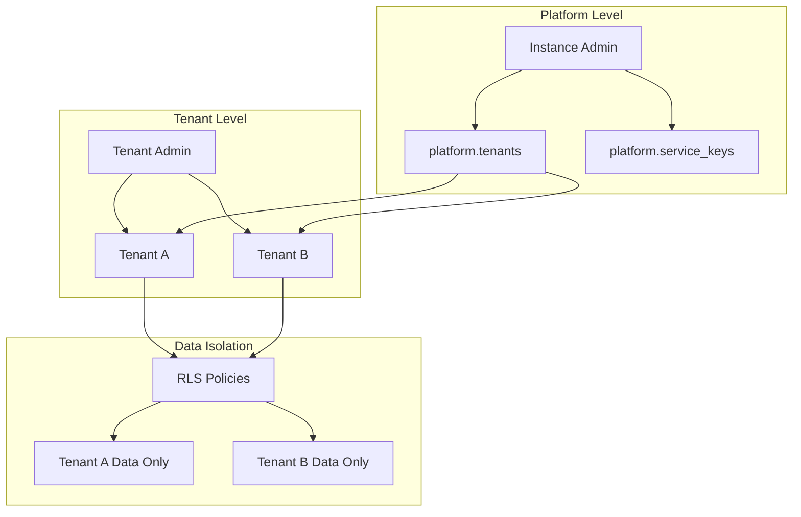

Fluxbase provides built-in multi-tenancy support using PostgreSQL Row Level Security (RLS) for automatic tenant isolation. This enables you to build SaaS applications where each tenant's data is completely isolated at the database level.

## Overview

Multi-tenancy in Fluxbase is implemented through:

- **Tenant Isolation**: Row-Level Security (RLS) policies automatically filter data by tenant
- **Tenant Service Keys**: Scoped API keys that enforce tenant boundaries
- **Platform Admin Roles**: Two-tier admin system for instance and tenant management

### Architecture



## Key Types

### Tenant

A tenant represents an organization or customer in your SaaS application:

```typescript
interface Tenant {
  id: string; // UUID
  slug: string; // URL-friendly identifier
  name: string; // Display name
  is_default: boolean; // Whether this is the default tenant
  metadata: Record<string, any> | null; // Custom metadata
  created_at: string;
  updated_at: string;
  deleted_at: string | null; // Soft delete
}
```

### Service Key Types

Fluxbase supports multiple key types for different use cases:

| Key Type         | Scope       | Use Case                                         |
| ---------------- | ----------- | ------------------------------------------------ |
| `anon`           | Global      | Anonymous/public access, no tenant context       |
| `publishable`    | User-scoped | User-specific operations, inherits user's tenant |
| `tenant_service` | Tenant      | Backend services for a specific tenant           |
| `global_service` | Instance    | Platform-wide operations, bypasses RLS           |

## Tenant Service Keys

Tenant service keys are scoped to a specific tenant and automatically enforce tenant isolation:

```typescript
import { createClient } from "@nimbleflux/fluxbase-sdk";

// Tenant-scoped client - all operations are isolated to tenant
const tenantClient = createClient(
  "http://localhost:8080",
  "tenant-service-key-here",
);

// This query only returns data for the key's tenant
const users = await tenantClient.from("users").select("*");
```

### Creating Tenant Service Keys

Use the Admin SDK to create tenant-scoped keys:

```typescript
// Create a tenant service key
const key = await client.admin.createServiceKey({
  tenant_id: "tenant-uuid",
  name: "Production API Key",
  key_type: "tenant_service",
  scopes: ["rest:read", "rest:write"],
  allowed_namespaces: ["public", "app"],
});
```

### Key Rotation

Service keys support graceful rotation:

```typescript
// Deprecate old key with grace period
await client.admin.deprecateServiceKey("old-key-id", {
  grace_period_hours: 24,
  replacement_key_id: "new-key-id",
});

// During grace period, both keys work
// After grace period, old key is revoked
```

## Platform Admin Roles

Fluxbase uses a two-tier admin system:

### Instance Admin (`instance_admin`)

- Full access to all tenants and data
- Can create/delete tenants
- Can manage global service keys
- Can assign tenant admins

### Tenant Admin (`tenant_admin`)

- Limited to their assigned tenants
- Can manage tenant service keys
- Can manage users within their tenant
- Cannot access other tenants

### Role Assignment

```sql
-- Check if user is instance admin
SELECT platform.is_instance_admin('user-uuid');

-- Get tenants managed by a user
SELECT * FROM platform.user_managed_tenant_ids('user-uuid');

-- Assign tenant admin
INSERT INTO platform.tenant_admin_assignments (user_id, tenant_id, assigned_by)
VALUES ('user-uuid', 'tenant-uuid', 'admin-uuid');
```

## Configuration

### Default Tenant

Configure a default tenant with pre-generated keys:

```yaml
tenants:
  default:
    name: "Default Tenant"
    # Option 1: Direct key values
    anon_key: "your-anon-key"
    service_key: "your-service-key"

    # Option 2: Load from files (recommended for production)
    anon_key_file: "/secrets/anon-key"
    service_key_file: "/secrets/service-key"
```

### Environment Variables

```bash
FLUXBASE_TENANTS_DEFAULT_NAME="Default Tenant"
FLUXBASE_TENANTS_DEFAULT_ANON_KEY="your-anon-key"
FLUXBASE_TENANTS_DEFAULT_SERVICE_KEY="your-service-key"
FLUXBASE_TENANTS_DEFAULT_ANON_KEY_FILE="/secrets/anon-key"
FLUXBASE_TENANTS_DEFAULT_SERVICE_KEY_FILE="/secrets/service-key"
```

## Tenant-Specific Configuration

Fluxbase supports per-tenant configuration overrides, allowing each tenant to have customized settings for authentication, storage, email, and other services. This is ideal for SaaS applications where different customers may require different configurations.

### Configuration Hierarchy

Values are resolved in this order (highest priority last):

1. **Hardcoded defaults** - Built-in default values
2. **Base YAML file** - `fluxbase.yaml` configuration
3. **Tenant YAML files** - `tenants/*.yaml` files
4. **Base environment variables** - `FLUXBASE_*` variables
5. **Tenant-specific env vars** - `FLUXBASE_TENANTS__<SLUG>__*` variables

### Overridable Sections

The following configuration sections can be overridden per-tenant:

| Section     | Description                                |
| ----------- | ------------------------------------------ |
| `auth`      | JWT secret, expiry, OAuth providers        |
| `storage`   | Provider (local/S3), bucket, region        |
| `email`     | Provider (SMTP/SES/SendGrid), from address |
| `functions` | Timeout, memory limits                     |
| `jobs`      | Worker count, queue settings               |
| `ai`        | Model, embedding settings                  |
| `realtime`  | WebSocket connection limits                |
| `api`       | Page size limits                           |
| `graphql`   | Query depth limits                         |
| `rpc`       | Procedure execution limits                 |

Instance-level settings (database, server, CORS, metrics, logging) remain global.

### Inline Tenant Configs

Define tenant overrides directly in `fluxbase.yaml`:

```yaml
# Base configuration (applies to all tenants)
auth:
  jwt_secret: "base-secret-change-in-production"
  jwt_expiry: "15m"

storage:
  provider: "local"
  local_path: "./storage"

# Tenant-specific overrides
tenants:
  default:
    name: "Platform"

  configs:
    acme-corp:
      auth:
        jwt_secret: "${ACME_JWT_SECRET}" # From environment variable
        jwt_expiry: "30m"
      storage:
        provider: "s3"
        s3_bucket: "acme-fluxbase"
        s3_region: "us-east-1"
      email:
        from_address: "noreply@acme.com"

    beta-corp:
      auth:
        jwt_expiry: "1h"
      functions:
        default_timeout: 60 # seconds
```

### Tenant Config Files

For GitOps-friendly workflows, store tenant configs in separate YAML files:

```yaml
# fluxbase.yaml
tenants:
  config_dir: "./tenants" # Load tenants/*.yaml files
```

```yaml
# tenants/acme-corp.yaml
slug: acme-corp
name: Acme Corporation
metadata:
  plan: enterprise
  billing_email: billing@acme.com

config:
  auth:
    jwt_secret: "${ACME_JWT_SECRET}"
    oauth_providers:
      - name: google
        enabled: true
        client_id: "${ACME_GOOGLE_CLIENT_ID}"
        client_secret: "${ACME_GOOGLE_CLIENT_SECRET}"

  storage:
    provider: s3
    s3_bucket: acme-fluxbase-prod
    s3_region: us-east-1

  email:
    provider: ses
    from_address: noreply@acme.com
    ses_region: us-east-1
```

### Environment Variable Interpolation

Tenant config files support `${VAR_NAME}` syntax for environment variable expansion:

```yaml
config:
  auth:
    jwt_secret: "${JWT_SECRET}" # Replaced with JWT_SECRET env var
  storage:
    s3_access_key: "${AWS_ACCESS_KEY_ID}"
    s3_secret_key: "${AWS_SECRET_ACCESS_KEY}"
```

### Tenant-Specific JWT Secrets

Each tenant can have its own JWT secret, allowing complete cryptographic isolation:

```yaml
tenants:
  configs:
    tenant-a:
      auth:
        jwt_secret: "tenant-a-secret-at-least-32-characters!"
    tenant-b:
      auth:
        jwt_secret: "tenant-b-secret-at-least-32-characters!"
```

When a request includes tenant context (via `X-FB-Tenant` header or JWT claims), tokens are validated using the tenant-specific secret.

### Storage Isolation

Configure different storage backends per tenant:

```yaml
tenants:
  configs:
    # EU tenant with EU data residency
    eu-customer:
      storage:
        provider: s3
        s3_bucket: eu-customer-data
        s3_region: eu-west-1

    # US tenant with US data residency
    us-customer:
      storage:
        provider: s3
        s3_bucket: us-customer-data
        s3_region: us-east-1
```

## API Examples

### Tenant Management

```typescript
import { createClient } from "@nimbleflux/fluxbase-sdk";

const client = createClient("http://localhost:8080", "global-service-key");

// List all tenants
const tenants = await client.admin.listTenants();

// Create a new tenant
const tenant = await client.admin.createTenant({
  slug: "acme-corp",
  name: "Acme Corporation",
  metadata: {
    plan: "enterprise",
    billing_email: "billing@acme.com",
  },
});

// Update tenant
await client.admin.updateTenant(tenant.id, {
  name: "Acme Corp Inc.",
  metadata: { plan: "pro" },
});

// Soft delete tenant
await client.admin.deleteTenant(tenant.id);
```

### Service Key Management

```typescript
// List keys for a tenant
const keys = await client.admin.listServiceKeys({
  tenant_id: "tenant-uuid",
});

// Create tenant service key
const key = await client.admin.createServiceKey({
  tenant_id: "tenant-uuid",
  name: "Backend Service",
  key_type: "tenant_service",
  scopes: ["rest:read", "rest:write", "storage:read", "storage:write"],
});

// Revoke a key
await client.admin.revokeServiceKey(key.id, "Security incident");

// Rotate keys
const newKey = await client.admin.rotateServiceKey(oldKeyId, {
  grace_period_hours: 48,
});
```

### Tenant Context in Queries

When using a tenant service key, all queries are automatically scoped:

```typescript
// With tenant service key
const tenantClient = createClient("http://localhost:8080", "tenant-key");

// Only returns users for this tenant
const users = await tenantClient.from("users").select("*");

// Inserts are automatically associated with tenant
const { data, error } = await tenantClient
  .from("posts")
  .insert({ title: "Hello", content: "World" });
// tenant_id is set automatically via RLS WITH CHECK policy
```

## Row Level Security

Tenant isolation is enforced through PostgreSQL RLS policies:

### Tenant Service Role

The `tenant_service` role is used for tenant-scoped operations:

```sql
-- Example RLS policy for tenant isolation
CREATE POLICY tenant_isolation ON public.posts
FOR ALL
TO tenant_service
USING (tenant_id = current_setting('app.tenant_id', true)::uuid)
WITH CHECK (tenant_id = current_setting('app.tenant_id', true)::uuid);
```

### Adding Tenant Columns

All tenant-scoped tables should have a `tenant_id` column:

```sql
ALTER TABLE your_table
ADD COLUMN tenant_id UUID REFERENCES platform.tenants(id) ON DELETE CASCADE;

CREATE INDEX idx_your_table_tenant_id ON your_table(tenant_id);
```

### RLS Policy Template

```sql
-- Enable RLS
ALTER TABLE your_table ENABLE ROW LEVEL SECURITY;

-- Tenant service can only see their tenant's data
CREATE POLICY tenant_select ON your_table
FOR SELECT TO tenant_service
USING (tenant_id = current_setting('app.tenant_id', true)::uuid);

CREATE POLICY tenant_insert ON your_table
FOR INSERT TO tenant_service
WITH CHECK (tenant_id = current_setting('app.tenant_id', true)::uuid);

CREATE POLICY tenant_update ON your_table
FOR UPDATE TO tenant_service
USING (tenant_id = current_setting('app.tenant_id', true)::uuid)
WITH CHECK (tenant_id = current_setting('app.tenant_id', true)::uuid);

CREATE POLICY tenant_delete ON your_table
FOR DELETE TO tenant_service
USING (tenant_id = current_setting('app.tenant_id', true)::uuid);
```

## Database Schema

### platform.tenants

```sql
CREATE TABLE platform.tenants (
    id UUID PRIMARY KEY DEFAULT gen_random_uuid(),
    slug TEXT UNIQUE NOT NULL,
    name TEXT NOT NULL,
    is_default BOOLEAN DEFAULT false,
    metadata JSONB DEFAULT '{}',
    created_at TIMESTAMPTZ DEFAULT now(),
    updated_at TIMESTAMPTZ DEFAULT now(),
    deleted_at TIMESTAMPTZ
);
```

### platform.service_keys

```sql
CREATE TABLE platform.service_keys (
    id UUID PRIMARY KEY DEFAULT gen_random_uuid(),
    name TEXT NOT NULL,
    key_type TEXT NOT NULL, -- anon, publishable, tenant_service, global_service
    tenant_id UUID REFERENCES platform.tenants(id) ON DELETE CASCADE,
    user_id UUID REFERENCES auth.users(id) ON DELETE CASCADE,
    key_hash TEXT NOT NULL,
    key_prefix TEXT NOT NULL,
    scopes TEXT[] DEFAULT '{}',
    allowed_namespaces TEXT[],
    is_active BOOLEAN DEFAULT true,
    is_config_managed BOOLEAN DEFAULT false,
    revoked_at TIMESTAMPTZ,
    deprecated_at TIMESTAMPTZ,
    grace_period_ends_at TIMESTAMPTZ,
    replaced_by UUID REFERENCES platform.service_keys(id),
    created_at TIMESTAMPTZ DEFAULT now(),
    updated_at TIMESTAMPTZ DEFAULT now()
);
```

### platform.tenant_admin_assignments

```sql
CREATE TABLE platform.tenant_admin_assignments (
    id UUID PRIMARY KEY DEFAULT gen_random_uuid(),
    user_id UUID NOT NULL REFERENCES platform.users(id) ON DELETE CASCADE,
    tenant_id UUID NOT NULL REFERENCES platform.tenants(id) ON DELETE CASCADE,
    assigned_by UUID REFERENCES platform.users(id) ON DELETE SET NULL,
    assigned_at TIMESTAMPTZ DEFAULT now(),
    UNIQUE(user_id, tenant_id)
);
```

## Best Practices

### Key Management

1. **Never expose global service keys** - Use only in backend services
2. **Rotate keys regularly** - Use graceful rotation to avoid downtime
3. **Scope keys minimally** - Grant only needed scopes and namespaces
4. **Use key files in production** - Avoid hardcoding keys

### Tenant Isolation

1. **Add tenant_id to all tables** - Every tenant-scoped table needs this column
2. **Create RLS policies** - Enforce isolation at database level
3. **Index tenant_id** - Essential for query performance
4. **Test isolation** - Verify tenants can't access each other's data

### Admin Access

1. **Use tenant admins** - Limit instance admin access
2. **Audit admin actions** - Log all administrative operations
3. **Regular access reviews** - Review tenant admin assignments periodically

## Instance-Level Settings & Tenant Settings

Fluxbase supports a hierarchical settings system where instance-level settings can be overridden at the tenant level.

### Settings Hierarchy

Values are resolved in this order (highest priority last):

1. **Hardcoded defaults** - Built-in default values
2. **Config file** - `fluxbase.yaml` configuration
3. **Instance settings (database)** - Stored in `platform.instance_settings`
4. **Tenant settings (database)** - Stored in `platform.tenant_settings`

### Overridable Settings

Instance admins can control which settings tenants are allowed to override using the `overridable_settings` column in `platform.instance_settings`.

```sql
-- View instance settings with override flags
SELECT * FROM platform.instance_settings;

-- Configure which settings can be overridden
UPDATE platform.instance_settings
SET overridable_settings = ARRAY['storage.max_upload_size', 'email.from_address'];
```

When a setting is marked as overridable, tenants can customize their value:

```sql
-- Set tenant-specific setting
INSERT INTO platform.tenant_settings (tenant_id, path, value)
VALUES ('tenant-uuid', 'storage.max_upload_size', 104857600);

-- Get effective setting (resolves tenant override)
SELECT * FROM platform.get_effective_setting('tenant-uuid', 'storage.max_upload_size');
```

Settings not in `overridable_settings` cannot be changed at the tenant level.

### Managing Settings via API

```typescript
// Get tenant settings
const settings = await client.admin.getTenantSettings("tenant-uuid");

// Update tenant setting
await client.admin.updateTenantSettings("tenant-uuid", {
  settings: {
    "storage.max_upload_size": 104857600,
    "email.from_address": "noreply@tenant.com",
  },
});

// Reset to instance default
await client.admin.resetTenantSetting("tenant-uuid", "storage.max_upload_size");
```

### Settings in Admin UI

Navigate to **Tenants > [Tenant Name] > Settings** tab to manage tenant-specific settings:

- View all settings with source badges (Instance/Tenant)
- Edit overridable settings
- Reset settings to instance defaults
- Lock non-overridable settings

## Tenant Declarative Schemas

Fluxbase supports declarative schema management for tenant databases, This allows you to define your tenant's database schema in SQL files that are automatically applied when a tenant is created or on server startup.

### Declarative Schema Configuration

Enable tenant declarative schemas in your `fluxbase.yaml`:

```yaml
tenants:
  declarative:
    enabled: true
    schema_dir: "./schemas" # Directory containing tenant schema files
    on_create: true # Apply schemas when creating a new tenant database
    on_startup: false # Apply schemas on server startup (for existing tenants)
    allow_destructive: false # Allow destructive schema changes (DROP, ALTER)
```

### Schema File Structure

Tenant schema files are organized by tenant slug:

```text
schemas/
├── acme-corp/
│   └── public.sql      # Schema for acme-corp tenant's public schema
├── beta-corp/
│   └── public.sql      # Schema for beta-corp tenant's public schema
└── default/
    └── public.sql      # Schema for default tenant (if using separate database)
```

### Example Schema File

Create `schemas/acme-corp/public.sql`:

```sql
-- Create tables for the acme-corp tenant
CREATE TABLE IF NOT EXISTS users (
    id UUID PRIMARY KEY DEFAULT gen_random_uuid(),
    email TEXT NOT NULL UNIQUE,
    name TEXT,
    created_at TIMESTAMPTZ DEFAULT now()
);

CREATE TABLE IF NOT EXISTS posts (
    id UUID PRIMARY KEY DEFAULT gen_random_uuid(),
    user_id UUID NOT NULL REFERENCES users(id) ON DELETE CASCADE,
    title TEXT NOT NULL,
    content TEXT,
    created_at TIMESTAMPTZ DEFAULT now()
);

CREATE INDEX IF NOT EXISTS idx_posts_user_id ON posts(user_id);

-- Enable RLS for tenant isolation
ALTER TABLE users ENABLE ROW LEVEL SECURITY;
ALTER TABLE posts ENABLE ROW LEVEL SECURITY;

-- Create RLS policies
CREATE POLICY users_tenant_isolation ON users
FOR ALL TO tenant_service
USING (tenant_id = current_setting('app.tenant_id', true)::uuid);

CREATE POLICY posts_tenant_isolation ON posts
FOR ALL TO tenant_service
USING (tenant_id = current_setting('app.tenant_id', true)::uuid);
```

### How It Works

1. **On Tenant Creation**: When a new tenant with a separate database is created, Fluxbase checks for a schema file in `{schema_dir}/{tenant-slug}/public.sql`
2. **Schema Application**: If a schema file exists, it's applied to the tenant's database
3. **Fingerprint Tracking**: Applied schemas are tracked by fingerprint (SHA256 hash) in the `migrations.tenant_declarative_state` table
4. **Idempotent Application**: Schemas are only re-applied if the fingerprint changes

### API Endpoints

Manage tenant schemas via the Admin API:

```typescript
// Get schema status for a tenant
const status = await client.admin.getTenantSchemaStatus("tenant-uuid");
// Returns: { has_schema_file, has_pending_changes, schema_fingerprint, ... }

// Apply schema for a specific tenant
await client.admin.applyTenantSchema("tenant-uuid");
```

### Declarative Schema Best Practices

1. **Version Control Schema Files**: Store schema files in Git alongside your application code
2. **Test Schema Changes**: Test schema changes in a development environment before production
3. **Use Idempotent SQL**: Use `IF NOT EXISTS` and `IF EXISTS` clauses for safe re-application
4. **Document Changes**: Comment schema files to explain the purpose of tables and policies

### Declarative Schema Environment Variables

```bash
FLUXBASE_TENANTS_DECLARATIVE_ENABLED=true
FLUXBASE_TENANTS_DECLARATIVE_SCHEMA_DIR=./schemas
FLUXBASE_TENANTS_DECLARATIVE_ON_CREATE=true
FLUXBASE_TENANTS_DECLARATIVE_ON_STARTUP=false
FLUXBASE_TENANTS_DECLARATIVE_ALLOW_DESTRUCTIVE=false
```

## Tenant-Scoped Branching

When database branching is enabled alongside multi-tenancy, branches can be scoped to individual tenants:

- Each branch record stores a `tenant_id` linking it to a tenant in `platform.tenants`
- Tenant-scoped branches get their own PostgreSQL database with a naming pattern of `{prefix}{tenant_slug}_{branch_slug}`
- The `max_branches_per_tenant` config option (default: 10) controls how many branches each tenant can create, independent of the global `max_total_branches` limit
- Deleting a tenant automatically cleans up all associated branches and their databases
- Connection pool routing priority is: branch pool > tenant pool > main pool, meaning a branch request always routes to the branch database when present

This allows each tenant to have isolated development and preview environments without affecting other tenants.

## Troubleshooting

### Empty Results with Tenant Key

If queries return empty results:

1. Verify the key is active: `SELECT is_active FROM platform.service_keys WHERE id = 'key-id'`
2. Check tenant_id column exists on the table
3. Verify RLS policy exists and uses `app.tenant_id` setting

### Cross-Tenant Data Access

If a tenant sees another tenant's data:

1. Check RLS is enabled: `SELECT rowsecurity FROM pg_tables WHERE tablename = 'your_table'`
2. Verify policy uses correct session variable
3. Ensure queries are using tenant service key, not global

### Key Rotation Issues

If old key still works after grace period:

1. Check `grace_period_ends_at` timestamp
2. Verify `revoked_at` is set after grace period
3. Check `is_active` is false

## Related Documentation

- [Row Level Security](/guides/row-level-security) - Detailed RLS implementation
- [Admin SDK](/sdk/admin) - Admin API reference
- [Configuration](/reference/configuration) - Configuration options
