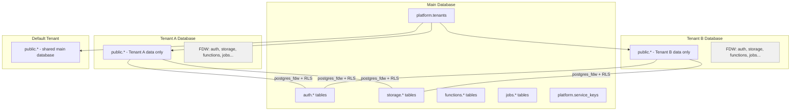

Fluxbase provides built-in multi-tenancy support using a **database-per-tenant** architecture. Each tenant gets its own PostgreSQL database for complete data isolation, while shared services (authentication, storage, functions, etc.) are accessed via PostgreSQL Foreign Data Wrappers (FDW). Row Level Security (RLS) enforces tenant boundaries at the database level.

## Overview

Multi-tenancy in Fluxbase is implemented through:

- **Database Isolation**: Each tenant gets a separate PostgreSQL database (or shares the main database for the default tenant)
- **Foreign Data Wrappers**: Shared schemas (auth, storage, functions, etc.) are imported from the main database into each tenant database via `postgres_fdw`
- **Row Level Security**: RLS policies enforce tenant boundaries using the `app.current_tenant_id` session variable
- **Tenant Service Keys**: Scoped API keys that enforce tenant boundaries automatically
- **Platform Admin Roles**: Two-tier admin system for instance and tenant management

### Architecture



### How It Works

1. **Default tenant**: Uses the main database directly. No separate database or FDW setup needed.
2. **Named tenants**: When created, Fluxbase provisions a separate PostgreSQL database (named `{prefix}{slug}`, e.g., `tenant_acme-corp`).
3. **FDW setup**: A per-tenant FDW role (`fdw_tenant_<uuid8>`) is created with `NOBYPASSRLS` and `app.current_tenant_id` set. Shared schemas are imported as foreign tables so the tenant database can access auth, storage, functions, etc.
4. **Connection routing**: When a request carries tenant context (via `X-FB-Tenant` header or JWT claims), Fluxbase routes to the tenant's database pool. The pool priority is: **branch pool > tenant pool > main pool**.
5. **RLS enforcement**: All tenant-scoped tables use RLS with `app.current_tenant_id` to filter data. The FDW role inherits this setting, ensuring tenant-scoped queries only see the tenant's data even for shared tables.

## Key Types

### Tenant

A tenant represents an organization or customer in your SaaS application:

```typescript
interface Tenant {
  id: string;
  slug: string;
  name: string;
  is_default: boolean;
  status: string; // "creating" | "active" | "deleting" | "error"
  db_name?: string | null; // null = uses main database (default tenant)
  metadata: Record<string, unknown> | null;
  created_at: string;
  updated_at?: string;
  deleted_at: string | null;
}
```

The `db_name` field indicates whether a tenant uses a separate database. When `null`, the tenant uses the main database (like the default tenant). When set, it's the name of the tenant's dedicated PostgreSQL database.

### Service Key Types

Fluxbase supports multiple key types for different use cases:

| Key Type          | Prefix        | Scope       | Use Case                                        |
| ----------------- | ------------- | ----------- | ----------------------------------------------- |
| `anon`            | `pk_anon_`    | Tenant      | Anonymous/public access                         |
| `publishable`     | `pk_live_`    | Tenant      | Client-side API access                          |
| `tenant_service`  | `sk_tenant_`  | Tenant      | Backend services, scoped to one tenant          |
| `global_service`  | `sk_global_`  | Instance    | Backend services, bypasses RLS, all tenants     |
| `service`         | `sk_`         | Instance    | Legacy service key, bypasses RLS                |

When creating keys via the API, use `key_type: "anon"` for public access or `key_type: "service"` for backend service access.

## Tenant Service Keys

Tenant service keys are scoped to a specific tenant and automatically enforce tenant isolation:

```typescript
import { createClient } from "@nimbleflux/fluxbase-sdk";

// Tenant-scoped client - all operations are isolated to tenant
const tenantClient = createClient(
  "http://localhost:8080",
  "tenant-service-key-here",
);

// This query only returns data for the key's tenant
const users = await tenantClient.from("users").select("*");
```

### Creating Tenant Service Keys

Use the Admin SDK to create tenant-scoped keys:

```typescript
// Create a tenant service key
const { data: key, error } = await client.admin.serviceKeys.create({
  name: "Production API Key",
  key_type: "service",
  scopes: ["*"],
});
```

### Key Rotation

Service keys support graceful rotation:

```typescript
// Deprecate old key with grace period
await client.admin.serviceKeys.deprecate("old-key-id", {
  grace_period_hours: 24,
});

// During grace period, both keys work
// After grace period, old key is revoked
```

## Platform Admin Roles

Fluxbase uses a two-tier admin system:

### Instance Admin (`instance_admin`)

- Full access to all tenants and data
- Can create/delete tenants
- Can manage global service keys
- Can assign tenant admins
- Bypasses RLS (has `BYPASSRLS` PostgreSQL attribute)

### Tenant Admin (`tenant_admin`)

- Limited to their assigned tenants
- Can manage tenant service keys
- Can manage users within their tenant
- Cannot access other tenants
- Respects RLS (maps to `authenticated` role for user data)

### Role Assignment

```sql
-- Check if user is instance admin
SELECT platform.is_instance_admin('user-uuid');

-- Get tenant IDs managed by a user (returns uuid[])
SELECT unnest(platform.user_managed_tenant_ids('user-uuid'));

-- Assign tenant admin
INSERT INTO platform.tenant_admin_assignments (user_id, tenant_id, assigned_by)
VALUES ('user-uuid', 'tenant-uuid', 'admin-uuid');
```

## Configuration

### Default Tenant

Configure a default tenant with pre-generated keys:

```yaml
tenants:
  default:
    name: "Default Tenant"
    # Option 1: Direct key values
    anon_key: "your-anon-key"
    service_key: "your-service-key"

    # Option 2: Load from files (recommended for production)
    anon_key_file: "/secrets/anon-key"
    service_key_file: "/secrets/service-key"
```

### Environment Variables

```bash
FLUXBASE_TENANTS_DEFAULT_NAME="Default Tenant"
FLUXBASE_TENANTS_DEFAULT_ANON_KEY="your-anon-key"
FLUXBASE_TENANTS_DEFAULT_SERVICE_KEY="your-service-key"
FLUXBASE_TENANTS_DEFAULT_ANON_KEY_FILE="/secrets/anon-key"
FLUXBASE_TENANTS_DEFAULT_SERVICE_KEY_FILE="/secrets/service-key"
```

### Tenant Infrastructure

```yaml
tenants:
  enabled: true
  database_prefix: "tenant_"  # Tenant DBs are named tenant_acme-corp
  max_tenants: 100

  pool:
    max_total_connections: 100  # Across all tenant pools
    eviction_age: 30m           # LRU pool eviction threshold

  migrations:
    check_interval: 5m          # Background migration worker interval
    on_create: true             # Run system migrations on tenant creation
    on_access: true             # Lazy migrations on first pool access
    background: true            # Enable background migration worker
```

```bash
FLUXBASE_TENANTS_ENABLED=true
FLUXBASE_TENANTS_DATABASE_PREFIX="tenant_"
FLUXBASE_TENANTS_MAX_TENANTS=100
FLUXBASE_TENANTS_POOL_MAX_TOTAL_CONNECTIONS=100
FLUXBASE_TENANTS_POOL_EVICTION_AGE=30m
FLUXBASE_TENANTS_MIGRATIONS_CHECK_INTERVAL=5m
FLUXBASE_TENANTS_MIGRATIONS_ON_CREATE=true
FLUXBASE_TENANTS_MIGRATIONS_ON_ACCESS=true
FLUXBASE_TENANTS_MIGRATIONS_BACKGROUND=true
```

## Creating Tenants

### Via API

When creating a tenant, Fluxbase can automatically provision a separate database:

```typescript
import { createClient } from "@nimbleflux/fluxbase-sdk";

const client = createClient("http://localhost:8080", "global-service-key");

// Create a tenant with an auto-provisioned database
const { data: tenant, error } = await client.tenant.create({
  slug: "acme-corp",
  name: "Acme Corporation",
  metadata: {
    plan: "enterprise",
    billing_email: "billing@acme.com",
  },
});
```

### Full Creation Options

```typescript
const { data: tenant, error } = await client.tenant.create({
  slug: "acme-corp",             // Required: lowercase, hyphens, starts with letter
  name: "Acme Corporation",      // Required: display name
  metadata: { plan: "enterprise" },

  // Database options
  db_mode: "auto",               // "auto" (new DB) or "existing" (use existing DB)
  db_name: null,                 // Required when db_mode="existing"

  // Admin assignment
  admin_email: "admin@acme.com", // Invite by email (creates invitation)
  admin_user_id: "user-uuid",    // Or assign existing user directly

  // Key generation
  auto_generate_keys: true,      // Auto-create anon + service keys (default: true)
  send_keys_to_email: true,      // Include keys in invitation email
});
```

### Tenant Lifecycle

The tenant creation flow:

1. A record is inserted in `platform.tenants` with status `creating`
2. A new PostgreSQL database is created (e.g., `tenant_acme-corp`)
3. Bootstrap runs: schemas, roles, and privileges are set up
4. Internal Fluxbase schemas (auth, storage, functions, jobs, etc.) are applied
5. FDW is configured: a per-tenant role is created, shared schemas are imported as foreign tables
6. Declarative schema is applied (if configured)
7. Status is set to `active`

### Tenant CRUD

```typescript
// List all tenants
const { data: tenants, error } = await client.tenant.list();

// Update tenant
await client.tenant.update(tenant.id, {
  name: "Acme Corp Inc.",
  metadata: { plan: "pro" },
});

// Soft delete tenant (sets deleted_at, keeps data)
await client.tenant.delete(tenant.id);

// Hard delete tenant (destroys database and all data)
await client.tenant.delete(tenant.id, { hard: true });

// Recover a soft-deleted tenant
await client.tenant.recover(tenant.id);

// Repair tenant (re-runs bootstrap + FDW setup)
await client.tenant.repair(tenant.id);

// Migrate tenant to latest schema
await client.tenant.migrate(tenant.id);
```

### Service Key Management

```typescript
// List keys for current tenant context
const { data: keys, error } = await client.admin.serviceKeys.list();

// Create tenant service key
const { data: key, error: keyError } = await client.admin.serviceKeys.create({
  name: "Backend Service",
  key_type: "service",
  scopes: ["*"],
});

// Revoke a key
await client.admin.serviceKeys.revoke(key.id, { reason: "Security incident" });

// Rotate keys
const { data: newKey, error: rotateError } = await client.admin.serviceKeys.rotate(oldKeyId);
```

## Tenant Context in Queries

When using a tenant service key or sending the `X-FB-Tenant` header, all queries are automatically scoped:

```typescript
// With tenant service key
const tenantClient = createClient("http://localhost:8080", "tenant-key");

// Only returns data for this tenant (enforced by RLS)
const users = await tenantClient.from("users").select("*");

// Insert with tenant context
const { data, error } = await tenantClient
  .from("posts")
  .insert({ title: "Hello", content: "World", tenant_id: "tenant-uuid" });
```

:::caution[Setting tenant_id on Insert]
For **user tables** in the `public` schema, you must include `tenant_id` in your insert payload. RLS policies validate the value matches the current tenant context, but they do not auto-populate it. Internal Fluxbase tables (auth.users, storage.objects, etc.) have database triggers that auto-set `tenant_id`.
:::

### Specifying Tenant Context

Tenant context is resolved in this priority order:

1. **`X-FB-Tenant` header** - Explicit tenant override (validated against user's membership)
2. **JWT claims** - `tenant_id` and `tenant_role` from the auth token
3. **Default tenant** - Falls back to `platform.tenants WHERE is_default = true`

```bash
# Explicit tenant via header
curl -H "X-FB-Tenant: acme-corp" \
     -H "Authorization: Bearer <service-key>" \
     http://localhost:8080/api/v1/tables/posts

# Or use a tenant-scoped service key (tenant_id is embedded in the key)
curl -H "Authorization: Bearer <tenant-service-key>" \
     http://localhost:8080/api/v1/tables/posts
```

## Row Level Security

Tenant isolation is enforced through PostgreSQL RLS policies using the `app.current_tenant_id` session variable:

### Tenant Service Role

The `tenant_service` role is used for tenant-scoped operations:

```sql
-- Example RLS policy for tenant isolation
CREATE POLICY tenant_isolation ON public.posts
FOR ALL
TO tenant_service
USING (tenant_id = current_setting('app.current_tenant_id', true)::uuid)
WITH CHECK (tenant_id = current_setting('app.current_tenant_id', true)::uuid);
```

### Role Mapping for Multi-Tenancy

| Dashboard Role      | PostgreSQL Role    | RLS Behavior                                       |
| -------------------- | ------------------ | -------------------------------------------------- |
| `anon`               | `anon`             | Public data only                                   |
| `authenticated`      | `authenticated`    | Own data only (via `auth.uid()`)                   |
| `tenant_admin`       | `authenticated`    | Own data + tenant management (scoped via header)   |
| `tenant_service`     | `tenant_service`   | All data within tenant (via `app.current_tenant_id`) |
| `instance_admin`     | `service_role`     | All data across all tenants (bypasses RLS)         |

### Adding Tenant Columns

All tenant-scoped tables should have a `tenant_id` column:

```sql
ALTER TABLE your_table
ADD COLUMN tenant_id UUID REFERENCES platform.tenants(id) ON DELETE CASCADE;

CREATE INDEX idx_your_table_tenant_id ON your_table(tenant_id);
```

### RLS Policy Template

```sql
-- Enable RLS
ALTER TABLE your_table ENABLE ROW LEVEL SECURITY;

-- Tenant service can only see their tenant's data
CREATE POLICY tenant_select ON your_table
FOR SELECT TO tenant_service
USING (tenant_id = current_setting('app.current_tenant_id', true)::uuid);

CREATE POLICY tenant_insert ON your_table
FOR INSERT TO tenant_service
WITH CHECK (tenant_id = current_setting('app.current_tenant_id', true)::uuid);

CREATE POLICY tenant_update ON your_table
FOR UPDATE TO tenant_service
USING (tenant_id = current_setting('app.current_tenant_id', true)::uuid)
WITH CHECK (tenant_id = current_setting('app.current_tenant_id', true)::uuid);

CREATE POLICY tenant_delete ON your_table
FOR DELETE TO tenant_service
USING (tenant_id = current_setting('app.current_tenant_id', true)::uuid);
```

## Database Schema

### platform.tenants

```sql
CREATE TABLE platform.tenants (
    id UUID PRIMARY KEY DEFAULT gen_random_uuid(),
    slug TEXT UNIQUE NOT NULL,
    name TEXT NOT NULL,
    is_default BOOLEAN DEFAULT false,
    status TEXT DEFAULT 'active' NOT NULL,
    db_name TEXT,
    metadata JSONB DEFAULT '{}',
    created_at TIMESTAMPTZ DEFAULT now(),
    updated_at TIMESTAMPTZ DEFAULT now(),
    deleted_at TIMESTAMPTZ
);
```

### platform.service_keys

```sql
CREATE TABLE platform.service_keys (
    id UUID PRIMARY KEY DEFAULT gen_random_uuid(),
    name TEXT NOT NULL,
    description TEXT,
    key_type TEXT NOT NULL, -- anon, publishable, tenant_service, global_service
    tenant_id UUID REFERENCES platform.tenants(id) ON DELETE CASCADE,
    user_id UUID, -- Owner of publishable keys (no FK constraint)
    key_hash TEXT NOT NULL,
    key_prefix TEXT NOT NULL,
    scopes TEXT[] DEFAULT '{}',
    allowed_namespaces TEXT[],
    rate_limit_per_minute INTEGER DEFAULT 60,
    is_active BOOLEAN DEFAULT true,
    is_config_managed BOOLEAN DEFAULT false,
    revoked_at TIMESTAMPTZ,
    revoked_by UUID,
    revocation_reason TEXT,
    deprecated_at TIMESTAMPTZ,
    grace_period_ends_at TIMESTAMPTZ,
    replaced_by UUID REFERENCES platform.service_keys(id),
    created_at TIMESTAMPTZ DEFAULT now(),
    updated_at TIMESTAMPTZ DEFAULT now(),
    created_by UUID,
    last_used_at TIMESTAMPTZ,
    expires_at TIMESTAMPTZ
);
```

### platform.tenant_admin_assignments

```sql
CREATE TABLE platform.tenant_admin_assignments (
    id UUID PRIMARY KEY DEFAULT gen_random_uuid(),
    user_id UUID NOT NULL REFERENCES platform.users(id) ON DELETE CASCADE,
    tenant_id UUID NOT NULL REFERENCES platform.tenants(id) ON DELETE CASCADE,
    assigned_by UUID REFERENCES platform.users(id) ON DELETE SET NULL,
    assigned_at TIMESTAMPTZ DEFAULT now(),
    UNIQUE(user_id, tenant_id)
);
```

### platform.tenant_memberships

```sql
CREATE TABLE platform.tenant_memberships (
    id UUID PRIMARY KEY DEFAULT gen_random_uuid(),
    user_id UUID NOT NULL REFERENCES platform.users(id) ON DELETE CASCADE,
    tenant_id UUID NOT NULL REFERENCES platform.tenants(id) ON DELETE CASCADE,
    role TEXT NOT NULL DEFAULT 'tenant_member',
    created_at TIMESTAMPTZ DEFAULT now(),
    UNIQUE(user_id, tenant_id)
);
```

## Tenant-Specific Configuration

Fluxbase supports per-tenant configuration overrides, allowing each tenant to have customized settings for authentication, storage, email, and other services. This is ideal for SaaS applications where different customers may require different configurations.

### Configuration Hierarchy

Values are resolved in this order (highest priority last):

1. **Hardcoded defaults** - Built-in default values
2. **Base YAML file** - `fluxbase.yaml` configuration
3. **Tenant YAML files** - `tenants/*.yaml` files
4. **Base environment variables** - `FLUXBASE_*` variables
5. **Tenant-specific env vars** - `FLUXBASE_TENANTS__<SLUG>__<SECTION>__<KEY>` variables

### Overridable Sections

The following configuration sections can be overridden per-tenant:

| Section     | Description                                |
| ----------- | ------------------------------------------ |
| `auth`      | JWT secret, expiry, OAuth providers        |
| `storage`   | Provider (local/S3), bucket, region        |
| `email`     | Provider (SMTP/SES/SendGrid), from address |
| `functions` | Timeout, memory limits                     |
| `jobs`      | Worker count, queue settings               |
| `ai`        | Model, embedding settings                  |
| `realtime`  | WebSocket connection limits                |
| `api`       | Page size limits                           |
| `graphql`   | Query depth limits                         |
| `rpc`       | Procedure execution limits                 |

Instance-level settings (database, server, CORS, metrics, logging) remain global.

### Inline Tenant Configs

Define tenant overrides directly in `fluxbase.yaml`:

```yaml
# Base configuration (applies to all tenants)
auth:
  jwt_secret: "base-secret-change-in-production"
  jwt_expiry: "15m"

storage:
  provider: "local"
  local_path: "./storage"

# Tenant-specific overrides
tenants:
  default:
    name: "Platform"

  configs:
    acme-corp:
      auth:
        jwt_secret: "${ACME_JWT_SECRET}" # From environment variable
        jwt_expiry: "30m"
      storage:
        provider: "s3"
        s3_bucket: "acme-fluxbase"
        s3_region: "us-east-1"
      email:
        from_address: "noreply@acme.com"

    beta-corp:
      auth:
        jwt_expiry: "1h"
      functions:
        default_timeout: 60 # seconds
```

### Tenant Config Files

For GitOps-friendly workflows, store tenant configs in separate YAML files:

```yaml
# fluxbase.yaml
tenants:
  config_dir: "./tenants" # Load tenants/*.yaml files
```

```yaml
# tenants/acme-corp.yaml
slug: acme-corp
name: Acme Corporation
metadata:
  plan: enterprise
  billing_email: billing@acme.com

config:
  auth:
    jwt_secret: "${ACME_JWT_SECRET}"
    oauth_providers:
      - name: google
        enabled: true
        client_id: "${ACME_GOOGLE_CLIENT_ID}"
        client_secret: "${ACME_GOOGLE_CLIENT_SECRET}"

  storage:
    provider: s3
    s3_bucket: acme-fluxbase-prod
    s3_region: us-east-1

  email:
    provider: ses
    from_address: noreply@acme.com
    ses_region: us-east-1
```

### Environment Variable Interpolation

Tenant config files support `${VAR_NAME}` syntax for environment variable expansion:

```yaml
config:
  auth:
    jwt_secret: "${JWT_SECRET}" # Replaced with JWT_SECRET env var
  storage:
    s3_access_key: "${AWS_ACCESS_KEY_ID}"
    s3_secret_key: "${AWS_SECRET_ACCESS_KEY}"
```

### Tenant-Specific JWT Secrets

Each tenant can have its own JWT secret, allowing complete cryptographic isolation:

```yaml
tenants:
  configs:
    tenant-a:
      auth:
        jwt_secret: "tenant-a-secret-at-least-32-characters!"
    tenant-b:
      auth:
        jwt_secret: "tenant-b-secret-at-least-32-characters!"
```

When a request includes tenant context (via `X-FB-Tenant` header or JWT claims), tokens are validated using the tenant-specific secret.

### Storage Isolation

Configure different storage backends per tenant:

```yaml
tenants:
  configs:
    # EU tenant with EU data residency
    eu-customer:
      storage:
        provider: s3
        s3_bucket: eu-customer-data
        s3_region: eu-west-1

    # US tenant with US data residency
    us-customer:
      storage:
        provider: s3
        s3_bucket: us-customer-data
        s3_region: us-east-1
```

## Instance-Level Settings & Tenant Settings

Instance-level settings are stored in `platform.instance_settings`. Tenant-specific overrides can be managed through the Admin API and dashboard.

### Managing Settings via API

Use the tenant settings API endpoints to manage per-tenant configuration:

```bash
# Get tenant settings
curl -H "Authorization: Bearer <service-key>" \
  http://localhost:8080/api/v1/admin/tenants/<tenant-id>/settings

# Update tenant setting
curl -X PATCH -H "Authorization: Bearer <service-key>" \
  -H "Content-Type: application/json" \
  -d '{"settings": {"storage.max_upload_size": 104857600}}' \
  http://localhost:8080/api/v1/admin/tenants/<tenant-id>/settings
```

## Tenant Declarative Schemas

Fluxbase supports declarative schema management for tenant databases. This allows you to define your tenant's database schema in SQL files that are automatically applied when a tenant is created or on server startup.

### Declarative Schema Configuration

Enable tenant declarative schemas in your `fluxbase.yaml`:

```yaml
tenants:
  declarative:
    enabled: true
    schema_dir: "./schemas" # Directory containing tenant schema files
    on_create: true # Apply schemas when creating a new tenant database
    on_startup: false # Apply schemas on server startup (for existing tenants)
    allow_destructive: false # Allow destructive schema changes (DROP, ALTER)
```

### Declarative Schema Environment Variables

```bash
FLUXBASE_TENANTS_DECLARATIVE_ENABLED=true
FLUXBASE_TENANTS_DECLARATIVE_SCHEMA_DIR=./schemas
FLUXBASE_TENANTS_DECLARATIVE_ON_CREATE=true
FLUXBASE_TENANTS_DECLARATIVE_ON_STARTUP=false
FLUXBASE_TENANTS_DECLARATIVE_ALLOW_DESTRUCTIVE=false
```

### Schema File Structure

Tenant schema files are organized by tenant slug:

```text
schemas/
├── acme-corp/
│   └── public.sql      # Schema for acme-corp tenant's public schema
├── beta-corp/
│   └── public.sql      # Schema for beta-corp tenant's public schema
└── default/
    └── public.sql      # Schema for default tenant (if using separate database)
```

### Example Schema File

Create `schemas/acme-corp/public.sql`:

```sql
-- Create tables for the acme-corp tenant
CREATE TABLE IF NOT EXISTS users (
    id UUID PRIMARY KEY DEFAULT gen_random_uuid(),
    email TEXT NOT NULL UNIQUE,
    name TEXT,
    created_at TIMESTAMPTZ DEFAULT now()
);

CREATE TABLE IF NOT EXISTS posts (
    id UUID PRIMARY KEY DEFAULT gen_random_uuid(),
    user_id UUID NOT NULL REFERENCES users(id) ON DELETE CASCADE,
    title TEXT NOT NULL,
    content TEXT,
    created_at TIMESTAMPTZ DEFAULT now()
);

CREATE INDEX IF NOT EXISTS idx_posts_user_id ON posts(user_id);
```

### How It Works

1. **On Tenant Creation**: When a new tenant with a separate database is created, Fluxbase checks for a schema file in `{schema_dir}/{tenant-slug}/public.sql`
2. **Schema Application**: If a schema file exists, it's applied to the tenant's database using diff-based planning (only changes are applied)
3. **Fingerprint Tracking**: Applied schemas are tracked by fingerprint (SHA256 hash) in the `platform.tenant_declarative_state` table
4. **Idempotent Application**: Schemas are only re-applied if the fingerprint changes

### API Endpoints

Manage tenant schemas via the Admin API:

```bash
# Get schema status for a tenant
curl -H "Authorization: Bearer <service-key>" \
  http://localhost:8080/api/v1/admin/tenants/<tenant-id>/schema

# Apply schema for a specific tenant (from filesystem)
curl -X POST -H "Authorization: Bearer <service-key>" \
  http://localhost:8080/api/v1/admin/tenants/<tenant-id>/schema/apply

# Upload and apply schema content
curl -X POST -H "Authorization: Bearer <service-key>" \
  -H "Content-Type: application/json" \
  -d '{"schema_sql": "CREATE TABLE ..."}' \
  http://localhost:8080/api/v1/admin/tenants/<tenant-id>/schema/content/apply

# Get stored schema content
curl -H "Authorization: Bearer <service-key>" \
  http://localhost:8080/api/v1/admin/tenants/<tenant-id>/schema/content

# Delete stored schema content
curl -X DELETE -H "Authorization: Bearer <service-key>" \
  http://localhost:8080/api/v1/admin/tenants/<tenant-id>/schema/content
```

### Declarative Schema Best Practices

1. **Version Control Schema Files**: Store schema files in Git alongside your application code
2. **Test Schema Changes**: Test schema changes in a development environment before production
3. **Use Idempotent SQL**: Use `IF NOT EXISTS` and `IF EXISTS` clauses for safe re-application
4. **Document Changes**: Comment schema files to explain the purpose of tables and policies

## Tenant-Scoped Branching

When database branching is enabled alongside multi-tenancy, branches can be scoped to individual tenants:

- Each branch record stores a `tenant_id` linking it to a tenant in `platform.tenants`
- Tenant-scoped branches get their own PostgreSQL database with a naming pattern of `{prefix}{tenant_slug}_{branch_slug}`
- The `max_branches_per_tenant` config option (default: 0, unlimited) controls how many branches each tenant can create, independent of the global `max_total_branches` limit
- Deleting a tenant automatically cleans up all associated branches and their databases
- Connection pool routing priority is: branch pool > tenant pool > main pool, meaning a branch request always routes to the branch database when present

When a tenant has a separate database, branches clone from the **tenant's database** (not the main database). After cloning, the FDW user mapping is automatically repaired so the branch database can still access shared schemas.

This allows each tenant to have isolated development and preview environments without affecting other tenants.

## Best Practices

### Key Management

1. **Never expose global service keys** - Use only in backend services
2. **Rotate keys regularly** - Use graceful rotation to avoid downtime
3. **Scope keys minimally** - Grant only needed scopes and namespaces
4. **Use key files in production** - Avoid hardcoding keys

### Tenant Isolation

1. **Use separate databases for production tenants** - Stronger isolation than RLS alone
2. **Add tenant_id to all tables** - Every tenant-scoped table needs this column
3. **Create RLS policies** - Enforce isolation at database level even with separate databases
4. **Index tenant_id** - Essential for query performance
5. **Test isolation** - Verify tenants can't access each other's data

### Admin Access

1. **Use tenant admins** - Limit instance admin access
2. **Audit admin actions** - Log all administrative operations
3. **Regular access reviews** - Review tenant admin assignments periodically

## Troubleshooting

### Empty Results with Tenant Key

If queries return empty results:

1. Verify the key is active: `SELECT is_active FROM platform.service_keys WHERE id = 'key-id'`
2. Check tenant_id column exists on the table
3. Verify RLS policy exists and uses `app.current_tenant_id` setting
4. Ensure you're including `tenant_id` in insert payloads for user tables

### Cross-Tenant Data Access

If a tenant sees another tenant's data:

1. Check RLS is enabled: `SELECT rowsecurity FROM pg_tables WHERE tablename = 'your_table'`
2. Verify policy uses correct session variable (`app.current_tenant_id`)
3. Ensure queries are using tenant service key, not global
4. Check that the tenant's FDW role has `NOBYPASSRLS` set

### FDW Connection Issues

If a tenant database can't access shared services:

1. Verify the FDW role exists: `SELECT * FROM pg_roles WHERE rolname LIKE 'fdw_tenant_%'`
2. Check user mappings: `\deu+` in the tenant database
3. Run tenant repair to re-setup FDW: `POST /api/v1/admin/tenants/<id>/repair`
4. Check that `app.current_tenant_id` is set on the FDW role: `SELECT rolname, rolconfig FROM pg_roles WHERE rolname LIKE 'fdw_tenant_%'`

### Key Rotation Issues

If old key still works after grace period:

1. Check `grace_period_ends_at` timestamp
2. Verify `revoked_at` is set after grace period
3. Check `is_active` is false

## Related Documentation

- [Row Level Security](/guides/row-level-security) - Detailed RLS implementation
- [Database Branching](/guides/branching/) - Branching with multi-tenancy
- [Admin SDK](/sdk/admin) - Admin API reference
- [Configuration](/reference/configuration/) - Configuration options
